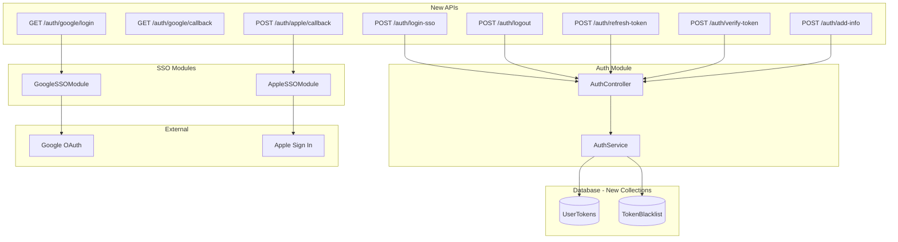

# PR #10: Authentication System Enhancements

Tài liệu chi tiết về các thay đổi authentication trong [PR #10](https://github.com/ntuspeechlab/api-gateway/pull/10).

## Summary of Changes

| Category | Changes |
|----------|---------|
| **New Modules** | GoogleSSOModule, AppleSSOModule |
| **New Schemas** | TokenBlacklist, UserTokens |
| **New APIs** | 8 endpoints for SSO, token management |
| **Security** | Single session, token blacklisting |

## Architecture Overview



---

## Files Changed

```
src/modules/auth/
├── auth.module.ts           # MongooseModule integration
├── auth.controller.ts       # New endpoints
├── auth.service.ts          # SSO verification, token management
├── local-auth.guard.ts      # Enhanced error handling
├── local.strategy.ts        # Better error messages
├── token-blacklist.schema.ts # [NEW] Revoked tokens
└── user-tokens.schema.ts    # [NEW] Active tokens

src/modules/google-sso/      # [NEW MODULE]
├── google-sso.module.ts
├── google-sso.controller.ts
├── google-sso.guard.ts
└── google.strategy.ts

src/modules/apple-sso/       # [NEW MODULE]
├── apple-sso.module.ts
└── apple-sso.controller.ts
```

---

## API Endpoints

### SSO Endpoints

| Method | Endpoint | Description | Doc |
|--------|----------|-------------|-----|
| `GET` | `/auth/google/login` | Redirect to Google OAuth | [SSO](./sso-providers.md#api-get-authgooglelogin) |
| `GET` | `/auth/google/callback` | Google OAuth callback | [SSO](./sso-providers.md#api-get-authgooglecallback) |
| `POST` | `/auth/apple/callback` | Apple Sign In callback | [SSO](./sso-providers.md#api-post-authapplecallback) |
| `POST` | `/auth/login-sso` | Login with ID token | [SSO](./sso-providers.md#api-post-authlogin-sso) |
| `POST` | `/auth/add-info` | Complete OAuth signup | [SSO](./sso-providers.md#api-post-authadd-info) |

### Token Management Endpoints

| Method | Endpoint | Description | Doc |
|--------|----------|-------------|-----|
| `POST` | `/auth/logout` | Revoke token | [Token](./token-management.md#api-post-authlogout) |
| `POST` | `/auth/refresh-token` | Refresh expired token | [Token](./token-management.md#api-post-authrefresh-token) |
| `POST` | `/auth/verify-token` | Check token validity | [Token](./token-management.md#api-post-authverify-token) |

### Session Security

| Method | Endpoint | Description | Doc |
|--------|----------|-------------|-----|
| `POST` | `/auth/login` | Login with single session | [Session](./session-security.md#api-post-authlogin) |

---

## Documentation Index

| Document | Content |
|----------|---------|
| [sso-providers.md](./sso-providers.md) | Google SSO, Apple SSO modules, /login-sso, /add-info APIs |
| [token-management.md](./token-management.md) | /logout, /refresh-token, /verify-token APIs |
| [session-security.md](./session-security.md) | /login API, single session enforcement |
| [database-schema.md](./database-schema.md) | UserTokens, TokenBlacklist collections |

---

## Database Collections

| Collection | Purpose | TTL |
|------------|---------|-----|
| `usertokens` | Active JWT tokens | ✓ |
| `tokenblacklists` | Revoked tokens | ✓ |

See [database-schema.md](./database-schema.md) for details.

---

## Quick Start

### Google SSO

```bash
# Browser redirect
GET https://api.example.com/auth/google/login?redirect=https://app.example.com
```

### Apple SSO

```bash
curl -X POST https://api.example.com/auth/apple/callback \
  -H "Content-Type: application/json" \
  -d '{"id_token": "apple-jwt-token"}'
```

### Token Verification

```bash
curl -X POST https://api.example.com/auth/verify-token \
  -H "Content-Type: application/json" \
  -d '{"token": "jwt-token"}'
```

### Logout

```bash
curl -X POST https://api.example.com/auth/logout \
  -H "Authorization: Bearer jwt-token"
```

---

## Configuration

```bash
# Google OAuth
AUTH_GOOGLE_CLIENT_ID=xxx.apps.googleusercontent.com
AUTH_GOOGLE_CLIENT_SECRET=xxx
AUTH_GOOGLE_CALLBACK_URL=http://localhost:3000/auth/google/callback
AUTH_GOOGLE_CLIENT_ID_IOS=xxx
AUTH_GOOGLE_CLIENT_ID_ANDROID=xxx

# Apple Sign In
APPLE_CLIENT_ID=com.example.app
APPLE_CLIENT_ID_ANDROID=com.example.app.android
FRONTEND_URL=https://app.example.com
```
