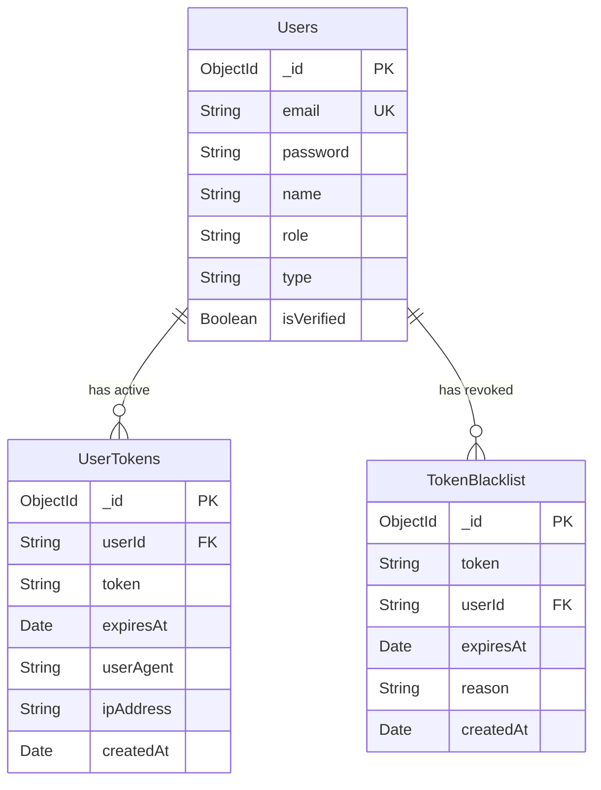
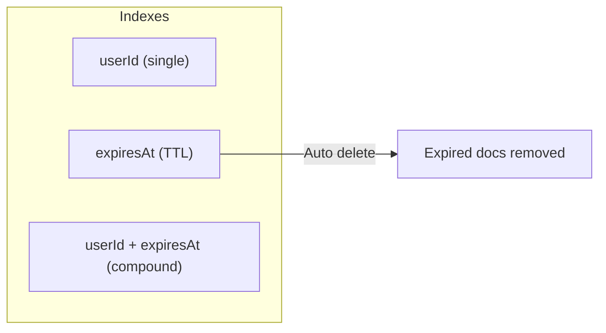
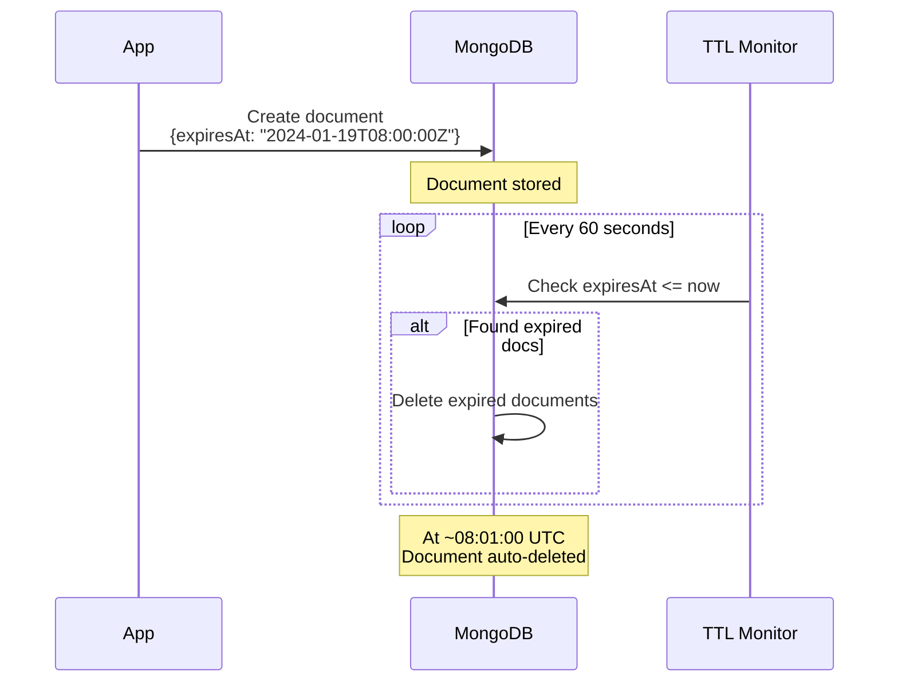

# Database Schema (PR #10)

Các collections mới được thêm trong PR #10 để hỗ trợ token management và session security.

## Entity Relationship Diagram



---

# UserTokens Collection

Theo dõi tất cả active JWT tokens.

## Schema Definition

```typescript
// user-tokens.schema.ts [NEW FILE]
import { Prop, Schema, SchemaFactory } from '@nestjs/mongoose'
import { Document } from 'mongoose'

@Schema({ timestamps: true })
export class UserToken extends Document {
  @Prop({ required: true, index: true })
  userId: string

  @Prop({ required: true })
  token: string

  @Prop({ required: true, type: Date })
  expiresAt: Date

  @Prop({ type: String })
  userAgent?: string

  @Prop({ type: String })
  ipAddress?: string
}

export const UserTokenSchema = SchemaFactory.createForClass(UserToken)

// TTL index - auto delete when expired
UserTokenSchema.index({ expiresAt: 1 }, { expireAfterSeconds: 0 })

// Compound index for user queries
UserTokenSchema.index({ userId: 1, expiresAt: 1 })
```

## Fields

| Field | Type | Required | Description |
|-------|------|----------|-------------|
| `userId` | String | ✓ | User ID (indexed) |
| `token` | String | ✓ | JWT token |
| `expiresAt` | Date | ✓ | Token expiration (TTL indexed) |
| `userAgent` | String | - | Browser/app info |
| `ipAddress` | String | - | Client IP address |
| `createdAt` | Date | Auto | Mongoose timestamp |

## Indexes



## Usage in Code

```typescript
// Create on login
await this.userTokenModel.create({
  userId: user._id.toString(),
  token,
  expiresAt: new Date(decoded.exp * 1000),
  userAgent,
  ipAddress,
})

// Find active tokens
const activeTokens = await this.userTokenModel.find({
  userId,
  expiresAt: { $gt: new Date() },
})

// Delete on logout
await this.userTokenModel.deleteOne({ token })

// Delete all user tokens
await this.userTokenModel.deleteMany({ userId })
```

## Sample Document

```json
{
  "_id": "64a1b2c3d4e5f6g7h8i9j0k1",
  "userId": "64a1b2c3d4e5f6g7h8i9j0k2",
  "token": "eyJhbGciOiJSUzI1NiIsInR5cCI6IkpXVCJ9...",
  "expiresAt": "2024-01-19T08:00:00.000Z",
  "userAgent": "Mozilla/5.0 (Macintosh; Intel Mac OS X 10_15_7)...",
  "ipAddress": "192.168.1.100",
  "createdAt": "2024-01-18T08:00:00.000Z",
  "updatedAt": "2024-01-18T08:00:00.000Z"
}
```

---

# TokenBlacklist Collection

Lưu trữ các tokens đã bị revoke.

## Schema Definition

```typescript
// token-blacklist.schema.ts [NEW FILE]
import { Prop, Schema, SchemaFactory } from '@nestjs/mongoose'
import { Document } from 'mongoose'

@Schema({ timestamps: true })
export class TokenBlacklist extends Document {
  @Prop({ required: true, index: true })
  token: string

  @Prop({ required: true, index: true })
  userId: string

  @Prop({ required: true, type: Date })
  expiresAt: Date

  @Prop({ type: String, default: 'manual' })
  reason: string // 'logout', 'new-login', 'refresh', 'manual'
}

export const TokenBlacklistSchema = SchemaFactory.createForClass(TokenBlacklist)

// TTL index - auto delete when token would have expired anyway
TokenBlacklistSchema.index({ expiresAt: 1 }, { expireAfterSeconds: 0 })

// Compound index for user queries
TokenBlacklistSchema.index({ userId: 1, expiresAt: 1 })
```

## Fields

| Field | Type | Required | Description |
|-------|------|----------|-------------|
| `token` | String | ✓ | Revoked JWT (indexed) |
| `userId` | String | ✓ | User ID (indexed) |
| `expiresAt` | Date | ✓ | Original token expiry (TTL indexed) |
| `reason` | String | - | Why revoked (default: 'manual') |
| `createdAt` | Date | Auto | When blacklisted |

## Reason Values

| Value | Triggered By | Description |
|-------|--------------|-------------|
| `logout` | `POST /auth/logout` | User manually logged out |
| `new-login` | `POST /auth/login` | New login revoked old tokens |
| `refresh` | `POST /auth/refresh-token` | Old token replaced with new |
| `manual` | Admin action | Manually revoked |

## Usage in Code

```typescript
// Add to blacklist on logout
await this.tokenBlacklistModel.create({
  token,
  userId,
  expiresAt: new Date(decoded.exp * 1000),
  reason: 'logout',
})

// Bulk insert on new login
await this.tokenBlacklistModel.insertMany(blacklistEntries, {
  ordered: false,
})

// Check if blacklisted
const blacklisted = await this.tokenBlacklistModel.findOne({ token })
if (blacklisted) {
  throw new UnauthorizedException('Token has been revoked')
}
```

## Sample Document

```json
{
  "_id": "64a1b2c3d4e5f6g7h8i9j0k3",
  "token": "eyJhbGciOiJSUzI1NiIsInR5cCI6IkpXVCJ9...",
  "userId": "64a1b2c3d4e5f6g7h8i9j0k2",
  "expiresAt": "2024-01-19T08:00:00.000Z",
  "reason": "logout",
  "createdAt": "2024-01-18T10:30:00.000Z",
  "updatedAt": "2024-01-18T10:30:00.000Z"
}
```

---

# TTL Index Behavior



## Key Points

- MongoDB kiểm tra TTL mỗi **60 giây**
- Documents có thể tồn tại thêm tối đa **60s** sau expiration
- Không cần cron job hay background worker
- Database tự động maintain size

---

# Module Integration

```typescript
// auth.module.ts
import { MongooseModule } from '@nestjs/mongoose'
import { TokenBlacklist, TokenBlacklistSchema } from './token-blacklist.schema'
import { UserToken, UserTokenSchema } from './user-tokens.schema'

@Module({
  imports: [
    // ... other imports
    MongooseModule.forFeature([
      { name: TokenBlacklist.name, schema: TokenBlacklistSchema },
      { name: UserToken.name, schema: UserTokenSchema },
    ]),
  ],
  // ...
})
export class AuthModule {}
```

```typescript
// auth.service.ts
@Injectable()
export class AuthService {
  constructor(
    @InjectModel(TokenBlacklist.name)
    private readonly tokenBlacklistModel: Model<TokenBlacklist>,
    @InjectModel(UserToken.name)
    private readonly userTokenModel: Model<UserToken>,
    // ... other dependencies
  ) {}
}
```

---

# Query Patterns

## Find Active Sessions

```typescript
// All active tokens for user
const sessions = await this.userTokenModel.find({
  userId,
  expiresAt: { $gt: new Date() },
}).select('userAgent ipAddress createdAt')
```

## Check Token Status

```typescript
// Is token blacklisted?
const isRevoked = await this.tokenBlacklistModel.exists({ token })

// Is token active?
const isActive = await this.userTokenModel.exists({ token })
```

## Analytics

```typescript
// Count active sessions
const activeSessions = await this.userTokenModel.countDocuments({
  expiresAt: { $gt: new Date() },
})

// Revocations by reason
const stats = await this.tokenBlacklistModel.aggregate([
  { $group: { _id: '$reason', count: { $sum: 1 } } }
])
```
