# Session Security (PR #10)

Cơ chế bảo mật session được thêm trong PR #10.

## Architecture


---

# API: POST /auth/login

Đăng nhập và áp dụng single session enforcement.

## Sequence Diagram

```mermaid
sequenceDiagram
    participant Client
    participant Guard as LocalAuthGuard
    participant Strategy as LocalStrategy
    participant Controller as AuthController
    participant Auth as AuthService
    participant JWT as JwtService
    participant DB as MongoDB

    Client->>Controller: POST /auth/login<br/>{email, password, appId?, appSecret?}
    
    Controller->>Guard: @UseGuards(LocalAuthGuard)
    Guard->>Strategy: validate(email, password)
    Strategy->>Auth: validateUser(email, password)
    Auth->>DB: Find user by email (+password)
    DB-->>Auth: user document
    Auth->>Auth: bcrypt.compareSync(password, hash)
    
    alt Password invalid
        Auth-->>Strategy: null
        Strategy-->>Guard: UnauthorizedException
        Guard-->>Client: 401 Invalid credentials
    end
    
    Auth-->>Strategy: user (without password)
    Strategy-->>Guard: user
    Guard-->>Controller: req.user = user
    
    Controller->>Auth: login(user, appId, appSecret, userAgent, ip)
    
    Note over Auth: Single Session Enforcement
    Auth->>Auth: revokeAllUserTokens(userId)
    Auth->>DB: Find all active UserTokens
    Auth->>DB: Bulk insert to TokenBlacklist<br/>reason: 'new-login'
    Auth->>DB: Delete all from UserTokens
    
    Note over Auth: Generate new token
    Auth->>JWT: sign(payload, options)
    JWT-->>Auth: token
    
    Auth->>DB: Insert to UserTokens<br/>{userId, token, expiresAt, userAgent, ip}
    
    Auth-->>Controller: {accessToken, subscriptionEnd, isVerified}
    Controller-->>Client: 200 OK
```



## Request

```json
{
  "email": "user@example.com",
  "password": "password123",
  "appId": "optional-third-party-app-id",
  "appSecret": "optional-app-secret"
}
```

## Response

```json
{
  "statusCode": 200,
  "success": true,
  "message": "Login successful",
  "accessToken": "eyJhbGciOiJSUzI1NiIsInR5cCI6IkpXVCJ9...",
  "subscriptionEnd": 1705651200000,
  "isVerified": true
}
```

## Implementation

### LocalAuthGuard (Enhanced Error Handling)

```typescript
// local-auth.guard.ts
@Injectable()
export class LocalAuthGuard extends AuthGuard('local') {
  async canActivate(context: ExecutionContext): Promise<boolean> {
    try {
      return (await super.canActivate(context)) as boolean
    } catch (error) {
      const response = context.switchToHttp().getResponse()
      const errorMessage = error.message === 'Invalid credentials'
        ? 'Invalid credentials'
        : 'Unauthorized'

      response.status(401).json({
        statusCode: 401,
        success: false,
        message: errorMessage,
      })
      return false
    }
  }

  handleRequest(err: any, user: any, info: any) {
    if (err || !user) {
      throw err || new UnauthorizedException('Invalid credentials')
    }
    return user
  }
}
```

### LocalStrategy

```typescript
// local.strategy.ts
@Injectable()
export class LocalStrategy extends PassportStrategy(Strategy) {
  constructor(private authService: AuthService) {
    super({ usernameField: 'email' })
  }

  async validate(email: string, password: string): Promise<any> {
    const user = await this.authService.validateUser(email, password)
    if (!user) {
      throw new UnauthorizedException('Invalid credentials')
    }
    return user
  }
}
```

### AuthService.login()

```typescript
// auth.service.ts
async login(user: User, appId?, appSecret?, userAgent?, ipAddress?) {
  // SINGLE SESSION: Revoke all existing tokens
  await this.revokeAllUserTokens(user._id.toString())

  const payload = {
    email: user.email,
    role: user.role,
    name: user.name,
    type: user.type,
  }
  const options: any = { subject: user._id.toString() }

  // Third-party app support
  if (appId && appSecret) {
    const app = await this.appService.findOneAndVerifySecret(
      { _id: appId, secret: appSecret }, true, '', true
    )
    if (!app) {
      throw new UnauthorizedException('Invalid application credentials')
    }
    options.audience = app._id.toString()
    options.keyid = (app.key as Key)._id.toString()
    options.privateKey = (app.key as Key).privateKey
  }

  const token = this.jwtService.sign(payload, options)
  const decoded: any = this.jwtService.decode(token)

  // Save to active tokens
  await this.userTokenModel.create({
    userId: user._id.toString(),
    token,
    expiresAt: new Date(decoded.exp * 1000),
    userAgent,
    ipAddress,
  })

  return {
    statusCode: 200,
    success: true,
    message: 'Login successful',
    accessToken: token,
    subscriptionEnd: (await this.subscriptionService.findByUser(user._id.toString())).endDate.getTime(),
    isVerified: user.isVerified,
  }
}
```

---

# Single Session Enforcement

## revokeAllUserTokens()

Khi user login, tất cả tokens cũ bị revoke.

### Sequence Diagram


### Implementation

```typescript
// auth.service.ts
async revokeAllUserTokens(userId: string): Promise<void> {
  // Find all active tokens
  const activeTokens = await this.userTokenModel.find({
    userId,
    expiresAt: { $gt: new Date() },
  })

  if (activeTokens.length === 0) {
    return
  }

  // Bulk insert to blacklist
  const blacklistEntries = activeTokens.map(tokenDoc => ({
    token: tokenDoc.token,
    userId: tokenDoc.userId,
    expiresAt: tokenDoc.expiresAt,
    reason: 'new-login',
  }))

  await this.tokenBlacklistModel.insertMany(blacklistEntries, {
    ordered: false,  // Continue on error
  })

  // Delete from active tokens
  await this.userTokenModel.deleteMany({
    userId,
    expiresAt: { $gt: new Date() },
  })
}
```

---

# Session Tracking

Mỗi login lưu metadata để tracking.


### Data Captured

| Field | Source | Example |
|-------|--------|---------|
| `userAgent` | `req.headers['user-agent']` | `Mozilla/5.0 (Windows NT 10.0...)` |
| `ipAddress` | `req.ip` | `192.168.1.100` |
| `expiresAt` | From JWT `exp` claim | `2024-01-19T08:00:00Z` |

---

# Token Blacklisting

## Reasons

| Reason | Trigger | Method |
|--------|---------|--------|
| `logout` | User logout | `logout()` |
| `new-login` | New login revokes old | `revokeAllUserTokens()` |
| `refresh` | Token refresh | `refreshAccessToken()` |

## Flow


---

# Security Benefits

| Feature | Benefit |
|---------|---------|
| Single Session | Stolen token invalidated on new login |
| IP/UserAgent Tracking | Audit trail for security review |
| Token Blacklisting | Immediate revocation capability |
| TTL Auto-cleanup | No database bloat |

---

# Error Responses

```json
// Invalid credentials
{
  "statusCode": 401,
  "success": false,
  "message": "Invalid credentials"
}

// Invalid app credentials
{
  "statusCode": 401,
  "success": false,
  "message": "Invalid application credentials"
}
```
