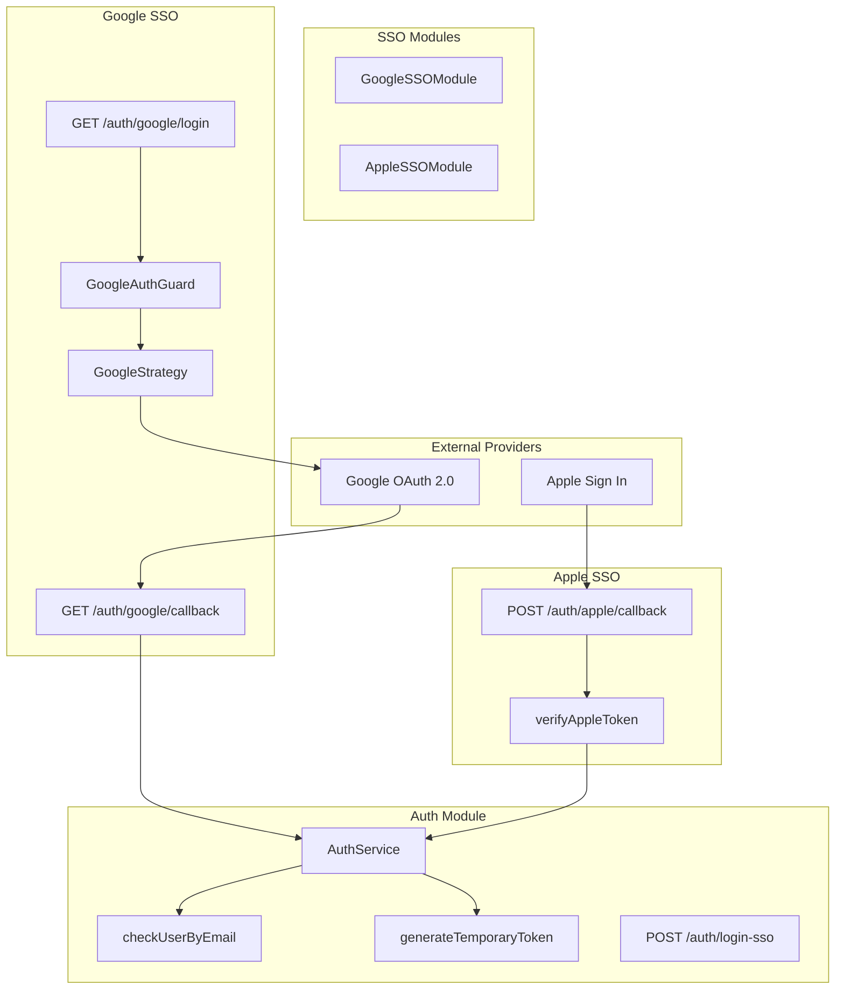
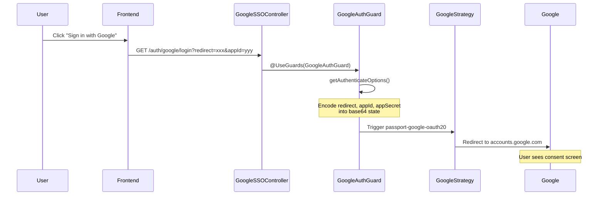
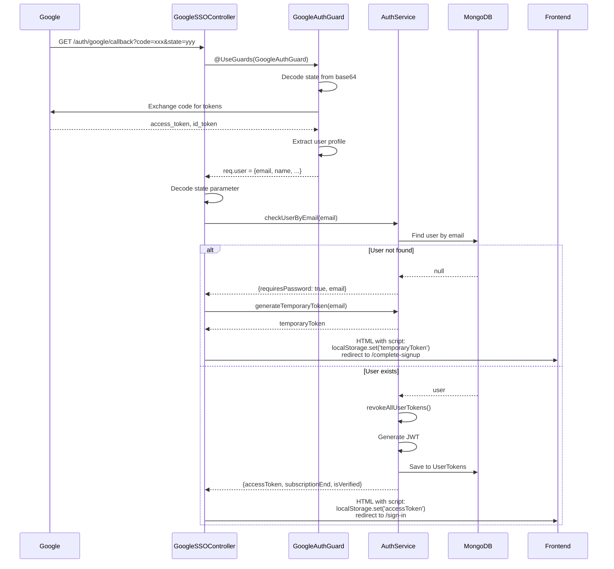
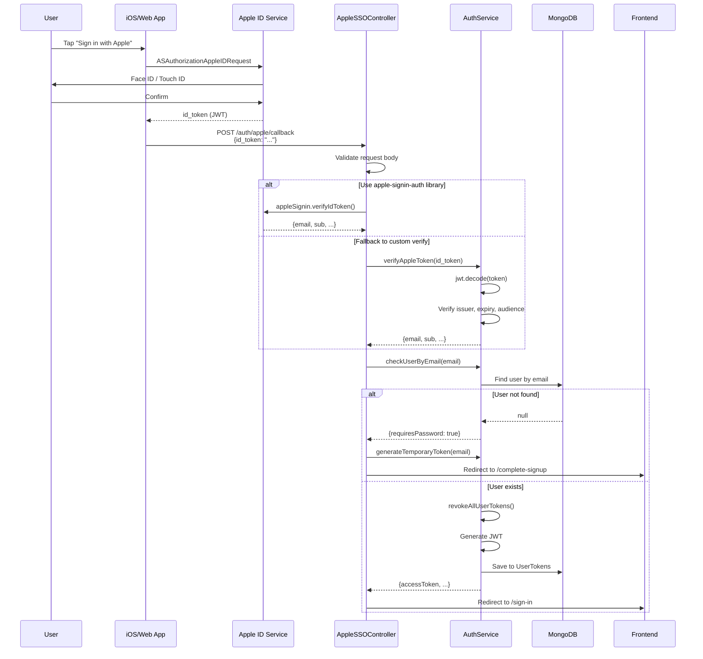
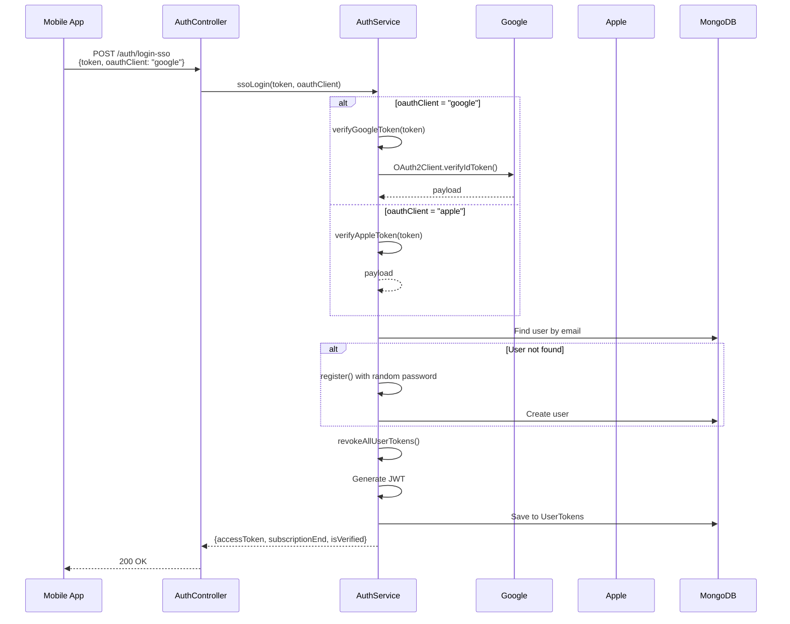
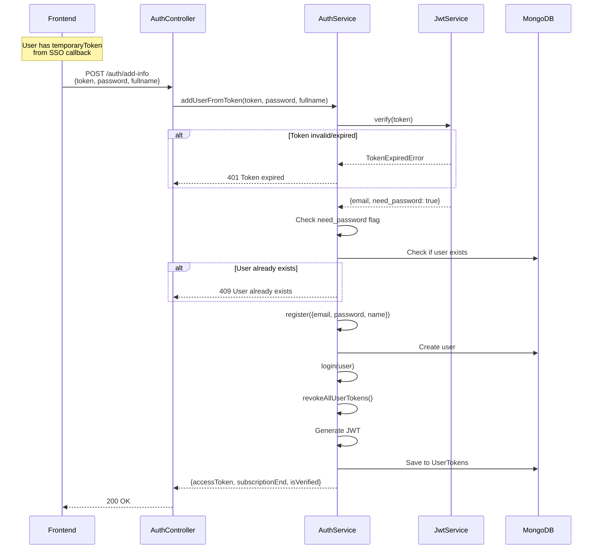

# SSO Providers (PR #10)

Tài liệu mô tả chi tiết hệ thống Single Sign-On được thêm trong PR #10.

## Architecture Overview



---

# Google SSO Module

## Files Structure

```
src/modules/google-sso/
├── google-sso.module.ts      # Module definition
├── google-sso.controller.ts  # OAuth endpoints
├── google-sso.guard.ts       # State handling guard
└── google.strategy.ts        # Passport strategy
```

---

## API: GET /auth/google/login

Khởi tạo OAuth flow, redirect user đến Google consent screen.

### Sequence Diagram



### Query Parameters

| Parameter | Required | Mô Tả |
|-----------|----------|-------|
| `redirect` | No | Frontend URL redirect sau auth |
| `appId` | No | Application ID |
| `appSecret` | No | Application secret |
| `prompt` | No | `select_account` (default), `consent`, `none` |

### Implementation

```typescript
// google-sso.controller.ts
@Get('login')
@UseGuards(GoogleAuthGuard)
async googleAuth(@Req() req: IRequest) {
  // Guard redirects to Google
}
```

```typescript
// google-sso.guard.ts
@Injectable()
export class GoogleAuthGuard extends AuthGuard('google') {
  getAuthenticateOptions(context: ExecutionContext) {
    const request = context.switchToHttp().getRequest()
    const { redirect, appId, appSecret, prompt } = request.query

    // Encode vào state để preserve qua OAuth flow
    const state = JSON.stringify({
      redirect: redirect || null,
      appId: appId || null,
      appSecret: appSecret || null,
    })

    return {
      state: Buffer.from(state).toString('base64'),
      prompt: prompt || 'select_account',
      access_type: 'offline',
    }
  }
}
```

```typescript
// google.strategy.ts
@Injectable()
export class GoogleStrategy extends PassportStrategy(Strategy, 'google') {
  constructor(@Inject(authConfig.KEY) private auth: ConfigType<typeof authConfig>) {
    super({
      clientID: auth.googleClientId,
      clientSecret: auth.googleClientSecret,
      callbackURL: auth.googleCallbackURL,
      scope: ['email', 'profile'],
      passReqToCallback: true,
    })
  }

  async validate(req, accessToken, _refreshToken, profile, done) {
    const user = {
      email: profile.emails[0].value,
      firstName: profile.name.givenName,
      lastName: profile.name.familyName,
      picture: profile.photos[0].value,
      accessToken,
    }
    done(null, user)
  }
}
```

---

## API: GET /auth/google/callback

Google redirect về đây sau khi user authorize.

### Sequence Diagram



### Implementation

```typescript
// google-sso.controller.ts
@Get('callback')
@UseGuards(GoogleAuthGuard)
async googleAuthRedirect(
  @Req() req: IRequest,
  @Res() res: Response,
  @Query('redirect') redirect?: string,
  @Query('state') state?: string,
) {
  const googleUser = req.user as any

  // Decode state để lấy original query params
  let redirectUrl = redirect
  let decodedAppId, decodedAppSecret

  if (state) {
    try {
      const decoded = JSON.parse(Buffer.from(state, 'base64').toString())
      redirectUrl = decoded.redirect || redirect
      decodedAppId = decoded.appId
      decodedAppSecret = decoded.appSecret
    } catch (error) {
      console.error('Failed to decode state:', error)
    }
  }

  const result = await this.authService.checkUserByEmail(
    googleUser.email,
    req.headers['user-agent'],
    req.ip,
    decodedAppId,
    decodedAppSecret,
  )

  if (redirectUrl) {
    const redirectUrlObj = new URL(redirectUrl)
    
    if (result.requiresPassword) {
      // New user - cần set password
      const temporaryToken = await this.authService.generateTemporaryToken(
        result.email, decodedAppId, decodedAppSecret
      )
      redirectUrlObj.pathname = '/complete-signup'
      return res.send(`
        <html><head><script>
          localStorage.setItem('temporaryToken', '${temporaryToken}');
          window.location.href = '${redirectUrlObj.toString()}';
        </script></head></html>
      `)
    } else if (result.accessToken) {
      // Existing user - logged in
      redirectUrlObj.pathname = '/sign-in'
      return res.send(`
        <html><head><script>
          localStorage.setItem('accessToken', '${result.accessToken}');
          localStorage.setItem('jwt', '${result.accessToken}');
          localStorage.setItem('subscriptionEnd', '${result.subscriptionEnd}');
          localStorage.setItem('isVerified', '${result.isVerified}');
          window.location.href = '${redirectUrlObj.toString()}';
        </script></head></html>
      `)
    }
  }

  return res.status(result.statusCode).json(result)
}
```

### Configuration

```bash
AUTH_GOOGLE_CLIENT_ID=xxx.apps.googleusercontent.com
AUTH_GOOGLE_CLIENT_SECRET=xxx
AUTH_GOOGLE_CALLBACK_URL=http://localhost:3000/auth/google/callback
```

---

# Apple SSO Module

## Files Structure

```
src/modules/apple-sso/
├── apple-sso.module.ts      # Module definition
└── apple-sso.controller.ts  # POST callback handler
```

---

## API: POST /auth/apple/callback

Handle Apple Sign In callback từ iOS/Web app.

### Sequence Diagram



### Request Body

```json
{
  "id_token": "eyJhbGciOiJSUzI1NiIsInR5cCI6IkpXVCJ9...",
  "code": "optional-authorization-code"
}
```

### Response (Existing User)

```json
{
  "statusCode": 200,
  "success": true,
  "message": "Login successful",
  "accessToken": "eyJhbGciOiJSUzI1NiIsInR5cCI6IkpXVCJ9...",
  "subscriptionEnd": 1705651200000,
  "isVerified": true
}
```

### Response (New User)

```json
{
  "statusCode": 200,
  "success": true,
  "message": "New user detected. Password required.",
  "requiresPassword": true,
  "email": "user@privaterelay.appleid.com"
}
```

### Implementation

```typescript
// apple-sso.module.ts
@Module({
  imports: [AuthModule],
  controllers: [AppleSSOController],
})
export class AppleSSOModule {}
```

```typescript
// apple-sso.controller.ts
interface AppleAuthDto {
  code?: string
  id_token?: string
}

@ApiTags('Apple SSO')
@Controller('auth/apple')
export class AppleSSOController {
  constructor(private readonly authService: AuthService) {}

  @Post('callback')
  async appleAuthCallback(@Body() body: AppleAuthDto, @Res() res: Response) {
    // Validate input
    if (!body.code && !body.id_token) {
      return res.status(HttpStatus.UNAUTHORIZED).json({
        statusCode: HttpStatus.UNAUTHORIZED,
        success: false,
        message: 'Apple authentication failed: No id_token received',
      })
    }

    // Verify token
    let appleResponse
    try {
      // Primary: use apple-signin-auth library
      appleResponse = await appleSignin.verifyIdToken(body.id_token, {
        audience: process.env.APPLE_CLIENT_ID,
        ignoreExpiration: false,
      })
    } catch (verifyError) {
      // Fallback: custom verification
      console.error('Apple token verification error:', verifyError)
      appleResponse = await this.authService.verifyAppleToken(body.id_token)
    }

    const redirectUrl = process.env.FRONTEND_URL

    try {
      const result = await this.authService.checkUserByEmail(
        appleResponse.email,
        undefined, undefined, undefined, undefined,
      )

      if (redirectUrl) {
        const redirectUrlObj = new URL(redirectUrl)
        
        if (result.requiresPassword) {
          const temporaryToken = await this.authService.generateTemporaryToken(
            result.email, undefined, undefined
          )
          redirectUrlObj.pathname = '/complete-signup'
          return res.send(`
            <html><head><script>
              localStorage.setItem('temporaryToken', '${temporaryToken}');
              window.location.href = '${redirectUrlObj.toString()}';
            </script></head></html>
          `)
        } else if (result.accessToken) {
          redirectUrlObj.pathname = '/sign-in'
          return res.send(`
            <html><head><script>
              localStorage.setItem('accessToken', '${result.accessToken}');
              localStorage.setItem('jwt', '${result.accessToken}');
              localStorage.setItem('subscriptionEnd', '${result.subscriptionEnd}');
              localStorage.setItem('isVerified', '${result.isVerified}');
              window.location.href = '${redirectUrlObj.toString()}';
            </script></head></html>
          `)
        }
      }

      return res.status(result.statusCode).json(result)
    } catch (error) {
      return res.status(HttpStatus.INTERNAL_SERVER_ERROR).json({
        statusCode: HttpStatus.INTERNAL_SERVER_ERROR,
        success: false,
        message: error.message || 'Authentication failed',
      })
    }
  }
}
```

### Custom Token Verification

```typescript
// auth.service.ts
async verifyAppleToken(token: string): Promise<any> {
  const appleClientIds = [
    this.configService.get('auth.appleClientId'),
    this.configService.get('auth.appleClientIdAndroid'),
  ].filter(Boolean)

  if (appleClientIds.length === 0) {
    throw new UnauthorizedException('No Apple Client IDs configured')
  }

  // Decode JWT
  const decoded = jwt.decode(token, { complete: true })
  if (!decoded) {
    throw new UnauthorizedException('Invalid Apple token format')
  }

  const payload = decoded.payload as any

  // Verify issuer
  if (payload.iss !== 'https://appleid.apple.com') {
    throw new UnauthorizedException('Invalid Apple token issuer')
  }

  // Check expiration
  const now = Math.floor(Date.now() / 1000)
  if (payload.exp && payload.exp < now) {
    throw new UnauthorizedException('Apple token has expired')
  }

  // Verify audience
  for (const clientId of appleClientIds) {
    if (payload.aud === clientId) {
      return payload
    }
  }

  throw new UnauthorizedException('Apple token audience mismatch')
}
```

### Configuration

```bash
APPLE_CLIENT_ID=com.example.app
APPLE_CLIENT_ID_ANDROID=com.example.app.android
FRONTEND_URL=https://app.example.com
```

---

# API: POST /auth/login-sso

Đăng nhập trực tiếp bằng ID token (cho mobile apps).

### Sequence Diagram



### Request

```json
{
  "token": "eyJhbGciOiJSUzI1NiIsInR5cCI6IkpXVCJ9...",
  "oauthClient": "google",
  "appId": "optional",
  "appSecret": "optional"
}
```

### Response

```json
{
  "statusCode": 200,
  "success": true,
  "message": "Login successful",
  "accessToken": "eyJhbGciOiJSUzI1NiIsInR5cCI6IkpXVCJ9...",
  "subscriptionEnd": 1705651200000,
  "isVerified": true
}
```

### Implementation

```typescript
// auth.controller.ts
@Post('/login-sso')
async ssoLogin(
  @Req() req: IRequest,
  @Body() body: { token: string; oauthClient: string; appId?: string; appSecret?: string },
) {
  const userAgent = req.headers['user-agent']
  const ipAddress = req.ip
  const result = await this.authService.ssoLogin(
    body.token, body.oauthClient,
    body.appId, body.appSecret,
    userAgent, ipAddress,
  )
  req.res?.status(result.statusCode)
  return result
}
```

```typescript
// auth.service.ts
async ssoLogin(token: string, oauthClient: string, ...) {
  let payload: any = null

  if (oauthClient === 'google') {
    payload = await this.verifyGoogleToken(token)
  } else if (oauthClient === 'apple') {
    payload = await this.verifyAppleToken(token)
  }

  payload.email = payload.email.toLowerCase()

  let user = await this.userService.findOne({ email: payload.email })

  if (!user) {
    // Auto-register with random password
    const newUser = await this.register({
      email: payload.email,
      name: payload.name,
      password: generate({ length: 8, numbers: true }),
      appId, appSecret,
    })
    user = newUser.user
  }

  return this.login(user, appId, appSecret, userAgent, ipAddress)
}
```

---

# API: POST /auth/add-info

Hoàn tất đăng ký cho OAuth user mới (set password).

### Sequence Diagram



### Request

```json
{
  "token": "eyJhbGciOiJSUzI1NiIsInR5cCI6IkpXVCJ9...",
  "password": "userPassword123",
  "fullname": "John Doe"
}
```

### Response

```json
{
  "statusCode": 200,
  "success": true,
  "message": "Login successful",
  "accessToken": "eyJhbGciOiJSUzI1NiIsInR5cCI6IkpXVCJ9...",
  "subscriptionEnd": 1705651200000,
  "isVerified": true
}
```

### Implementation

```typescript
// auth.controller.ts
@Post('/add-info')
async setPassword(
  @Req() req: IRequest,
  @Body() body: { token: string; password: string; fullname: string },
) {
  const userAgent = req.headers['user-agent']
  const ipAddress = req.ip
  const result = await this.authService.addUserFromToken(
    body.token, body.password, body.fullname,
    userAgent, ipAddress,
  )
  req.res?.status(result.statusCode)
  return result
}
```

```typescript
// auth.service.ts
async addUserFromToken(token: string, password: string, fullname: string, ...) {
  // Verify temporary token
  let decoded: any
  try {
    decoded = this.jwtService.verify(token)
  } catch (error) {
    if (error.name === 'TokenExpiredError') {
      return { statusCode: 401, success: false, message: 'Token expired. Please sign in again.' }
    }
    return { statusCode: 400, success: false, message: 'Invalid token' }
  }

  // Verify this is a password setup token
  if (!decoded.need_password) {
    return { statusCode: 400, success: false, message: 'Invalid token type' }
  }

  const { email, appId, appSecret } = decoded

  // Check if user exists
  const existingUser = await this.userService.findOne({ email: email.toLowerCase() })
  if (existingUser) {
    return { statusCode: 409, success: false, message: 'User already exists' }
  }

  // Create user
  const newUser = await this.register({
    email: email.toLowerCase(),
    name: fullname,
    password,
    appId, appSecret,
  })

  // Login and return token
  return this.login(newUser.user, appId, appSecret, userAgent, ipAddress)
}
```

---

# Helper Methods

## checkUserByEmail()

Kiểm tra user tồn tại và trả về appropriate response.

```typescript
async checkUserByEmail(email: string, userAgent?, ipAddress?, appId?, appSecret?) {
  const user = await this.userService.findOne({ email: email.toLowerCase() })

  if (!user) {
    return {
      statusCode: 200,
      success: true,
      message: 'New user detected. Password required.',
      requiresPassword: true,
      email: email.toLowerCase(),
    }
  }

  // User exists - login
  return this.login(user, appId, appSecret, userAgent, ipAddress)
}
```

## generateTemporaryToken()

Tạo JWT tạm thời cho password setup (15 phút).

```typescript
async generateTemporaryToken(email: string, appId?: string, appSecret?: string) {
  return this.jwtService.sign({
    email: email.toLowerCase(),
    need_password: true,
    appId: appId || null,
    appSecret: appSecret || null,
  }, { expiresIn: '15m' })
}
```

---

# Error Handling

| Error | Code | Cause |
|-------|------|-------|
| `Google authentication failed` | 401 | OAuth flow cancelled |
| `No id_token received` | 401 | Missing Apple token |
| `Token expired` | 401 | Temporary token expired |
| `User already exists` | 409 | Email already registered |
| `Invalid Apple token issuer` | 401 | Token not from Apple |
