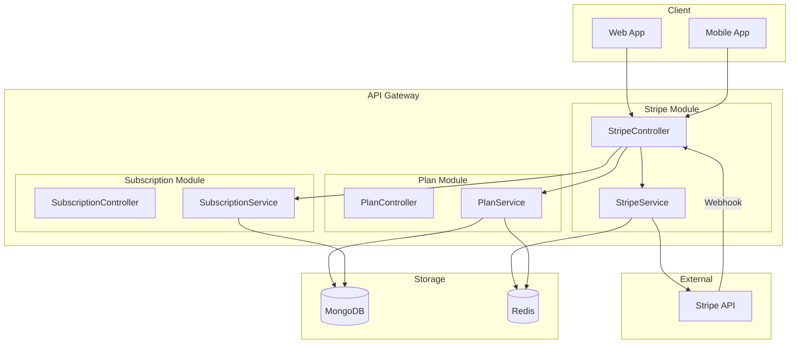
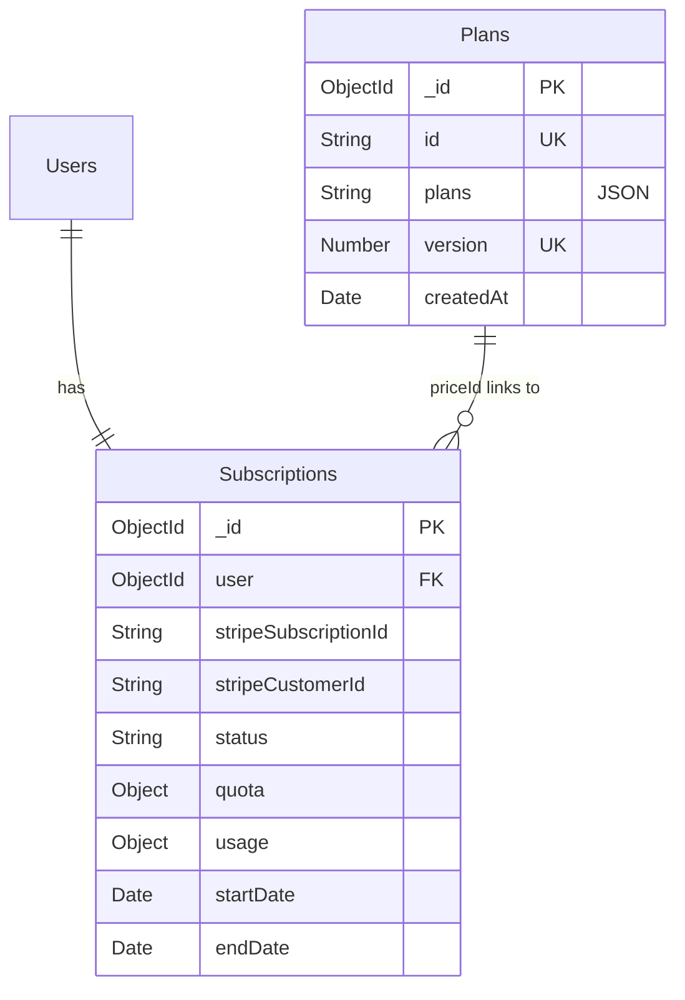
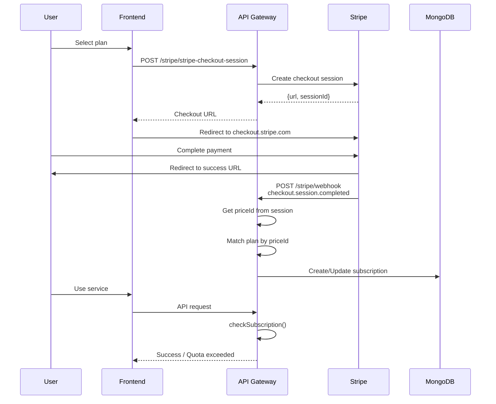

# Payment System (PR #10)

Tài liệu về hệ thống payment với Plan, Subscription, và Stripe integration.

## Architecture Overview



---

## Modules

| Module | Description | Documentation |
|--------|-------------|---------------|
| **Plan** | Pricing plans với versioning và Redis caching | [plan.md](./plan.md) |
| **Subscription** | User subscription với quota tracking | [subscription.md](./subscription.md) |
| **Stripe** | Payment processing và webhook handling | [stripe.md](./stripe.md) |

---

## Database Schema



---

## API Endpoints

### Plan APIs

| Method | Endpoint | Auth | Description |
|--------|----------|------|-------------|
| `POST` | `/plans` | Admin | Create new plan version |
| `GET` | `/plans/latest` | Public | Get latest plans (cached) |

### Subscription APIs

| Method | Endpoint | Auth | Description |
|--------|----------|------|-------------|
| `GET` | `/subscriptions/user/:id` | User/Admin | Get subscription |
| `PUT` | `/subscriptions/user/:id` | Admin | Update subscription |

### Stripe APIs

| Method | Endpoint | Auth | Description |
|--------|----------|------|-------------|
| `POST` | `/stripe/stripe-checkout-session` | User | Create checkout session |
| `POST` | `/stripe/webhook` | Stripe | Handle webhooks |
| `POST` | `/stripe/check-subscription-status` | User | Check sub status |
| `POST` | `/stripe/cancel-subscription` | User | Cancel subscription |
| `POST` | `/stripe/resume-subscription` | User | Resume subscription |
| `POST` | `/stripe/get-price` | Public | Get price info (cached) |

---

## Payment Flow



---

## Redis Caching

| Key Pattern | TTL | Purpose |
|-------------|-----|---------|
| `plan:latest` | 1 hour | Cache latest plan version |
| `stripe:price:xxx` | 24 hours | Cache Stripe price info |

### Cache Invalidation

| Event | Action |
|-------|--------|
| New plan created | Delete `plan:latest` |
| Price not found | Cache `NULL` for 60s |

---

## Configuration

```bash
# Stripe
STRIPE_SECRET_KEY=sk_xxx
STRIPE_WEBHOOK_SECRET=whsec_xxx
STRIPE_SUCCESS_URL=https://app.example.com/success
STRIPE_CANCEL_URL=https://app.example.com/cancel

# Redis
REDIS_HOST=localhost
REDIS_PORT=6379
REDIS_PASSWORD=secret
```

---

## Files Changed (PR #10)

```
src/modules/plan/
├── plan.module.ts
├── plan.controller.ts
├── plan.service.ts      # Redis caching
├── plan.schema.ts
└── plan.dto.ts

src/modules/subscription/
├── subscription.module.ts
├── subscription.controller.ts
├── subscription.service.ts
├── subscription.schema.ts  # quota, usage, stripeIds
└── subscription.dto.ts

src/modules/stripe/
├── stripe.module.ts
├── stripe.controller.ts    # Webhook, cancel, resume
├── stripe.service.ts       # Redis caching
└── stripe.dto.ts
```
