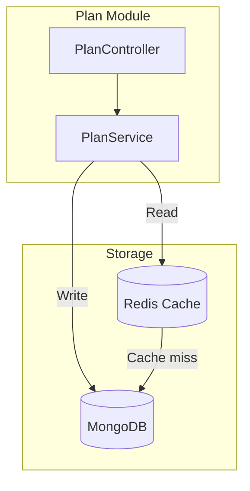
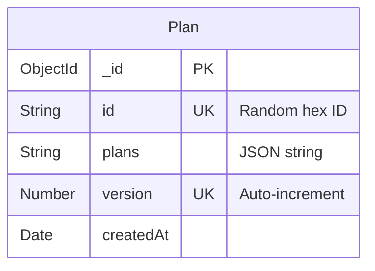
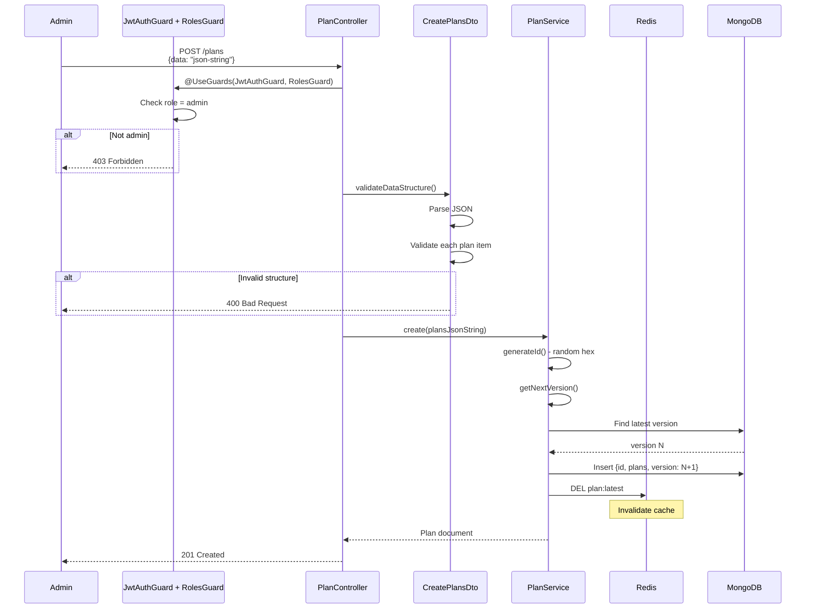
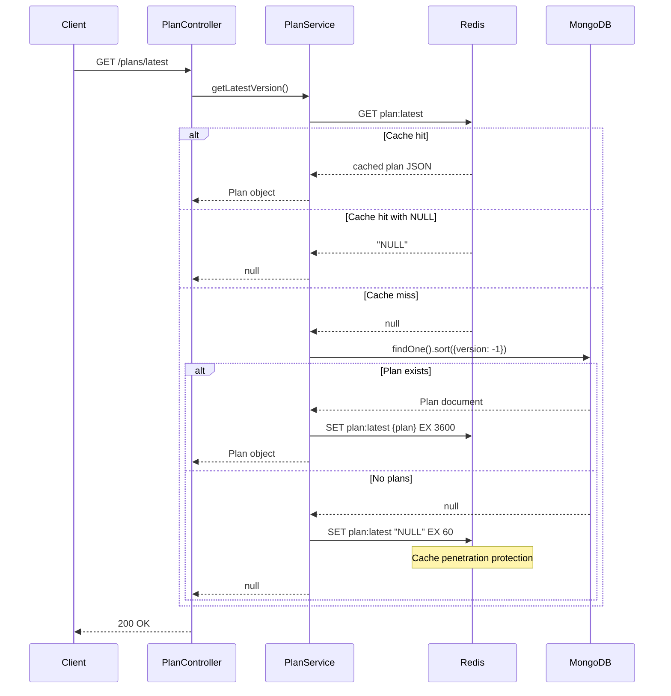
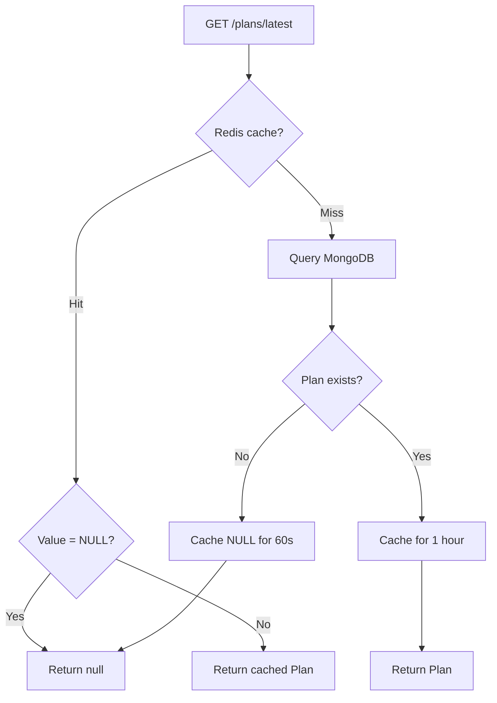

# Plan Module (PR #10)

Quản lý pricing plans với versioning và Redis caching.

## Architecture



---

## Database Schema



### Schema Definition

```typescript
// plan.schema.ts
@Schema({ timestamps: { createdAt: true, updatedAt: false } })
export class Plan extends Document {
  @Prop({ required: true, type: String, unique: true })
  id: string

  @Prop({ required: true, type: String })
  plans: string  // JSON string

  @Prop({ required: true, type: Number, unique: true })
  version: number
}

// Index for fast latest version query
PlanSchema.index({ version: -1 })
```

### Plans JSON Structure

```json
{
  "plans": [
    {
      "id": "basic",
      "name": "Basic Plan",
      "features": ["Feature 1", "Feature 2"],
      "priceId": "price_xxx",
      "recommended": false,
      "batchDuration": 3600,
      "liveDuration": 1800
    },
    {
      "id": "pro",
      "name": "Pro Plan",
      "features": ["All Basic", "Feature 3"],
      "priceId": "price_yyy",
      "recommended": true,
      "batchDuration": -1,
      "liveDuration": -1
    }
  ]
}
```

---

# API: POST /plans

Tạo mới plan version (Admin only).

## Sequence Diagram



## Request

```json
{
  "data": "{\"plans\":[{\"id\":\"basic\",\"name\":\"Basic\",\"features\":[\"Feature 1\"],\"priceId\":\"price_xxx\",\"batchDuration\":3600,\"liveDuration\":1800}]}"
}
```

## Response

```json
{
  "statusCode": 201,
  "message": "Plans created successfully",
  "data": {
    "plans": "{\"plans\":[...]}",
    "version": 1
  }
}
```

## Implementation

```typescript
// plan.controller.ts
@ApiBearerAuth()
@UseGuards(JwtAuthGuard, RolesGuard, EnsureEmailVerifiedGuard)
@Roles(Role.Admin)
@Post()
async create(@Body() dto: CreatePlansDto) {
  await dto.validateDataStructure()
  
  const result = await this.planService.create(dto.data)
  
  return {
    statusCode: HttpStatus.CREATED,
    message: 'Plans created successfully',
    data: { plans: result.plans, version: result.version },
  }
}
```

```typescript
// plan.service.ts
async create(plansJsonString: string): Promise<Plan> {
  const id = this.generateId()
  const version = await this.getNextVersion()

  const doc = await this.planModel.create({
    id,
    plans: plansJsonString,
    version,
  })

  // Invalidate cache
  await this.redisClient.del(this.CACHE_KEY)

  return doc
}
```

### DTO Validation

```typescript
// plan.dto.ts
export class CreatePlansDto {
  @IsNotEmpty()
  @IsString()
  data: string

  async validateDataStructure(): Promise<void> {
    const parsed = JSON.parse(this.data)
    
    // Validate structure
    if (!parsed.plans || !Array.isArray(parsed.plans)) {
      throw new BadRequestException('Invalid plans structure')
    }

    // Validate each plan
    for (const plan of parsed.plans) {
      // Required: id, name, features, priceId, batchDuration, liveDuration
      // Optional: recommended (boolean)
    }
  }
}
```

---

# API: GET /plans/latest

Lấy plan version mới nhất (Public, cached).

## Sequence Diagram



## Response

```json
{
  "statusCode": 200,
  "message": "Latest plans retrieved successfully",
  "data": {
    "plans": "{\"plans\":[...]}",
    "version": 3
  }
}
```

## Redis Caching Strategy

```typescript
// plan.service.ts
private readonly CACHE_KEY = 'plan:latest'
private readonly CACHE_TTL = 3600    // 1 hour
private readonly NULL_TTL = 60       // 60s for cache penetration protection

async getLatestVersion(): Promise<Plan | null> {
  // Check cache first
  const cached = await this.redisClient.get(this.CACHE_KEY)
  
  if (cached) {
    if (cached === 'NULL') {
      return null  // Cache penetration protection
    }
    return JSON.parse(cached) as Plan
  }

  // Cache miss - query DB
  const latestPlan = await this.planModel
    .findOne()
    .sort({ version: -1 })
    .exec()

  if (latestPlan) {
    await this.redisClient.set(
      this.CACHE_KEY,
      JSON.stringify(latestPlan),
      { EX: this.CACHE_TTL }
    )
  } else {
    // Cache penetration protection
    await this.redisClient.set(
      this.CACHE_KEY,
      'NULL',
      { EX: this.NULL_TTL }
    )
  }

  return latestPlan
}
```

## Cache Flow Diagram



---

# Configuration

```bash
# Redis
REDIS_HOST=localhost
REDIS_PORT=6379
REDIS_PASSWORD=secret
```

---

# Module Setup

```typescript
// plan.module.ts
@Module({
  imports: [
    MongooseModule.forFeature([{ name: Plan.name, schema: PlanSchema }]),
    ConfigModule,
  ],
  providers: [PlanService],
  controllers: [PlanController],
  exports: [PlanService],
})
export class PlanModule {}
```
