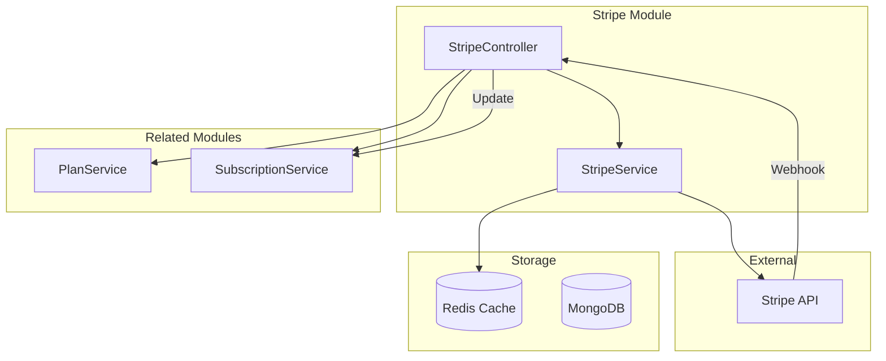
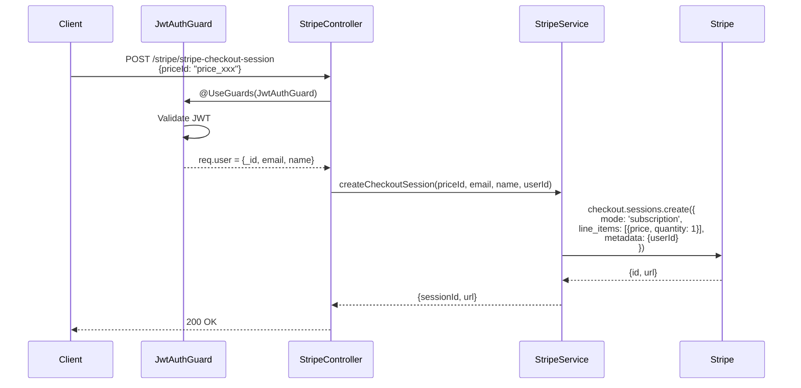
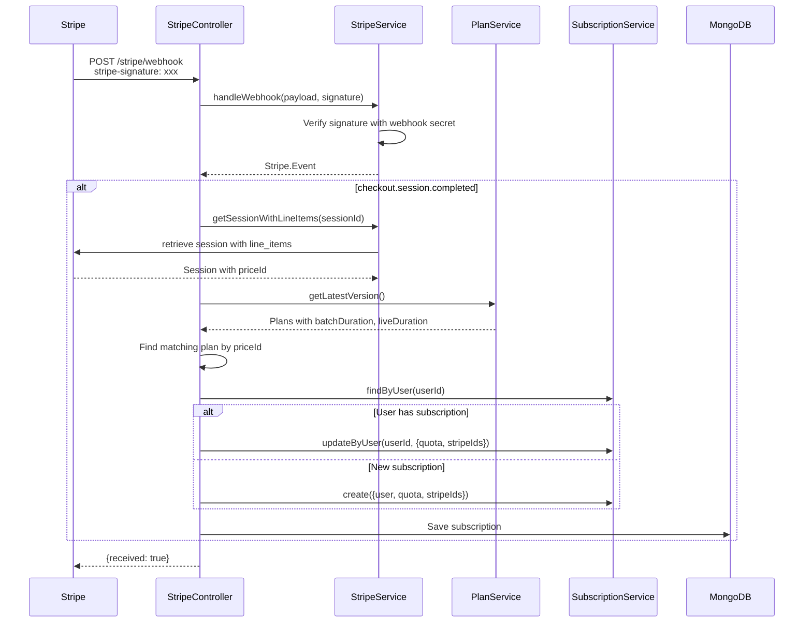
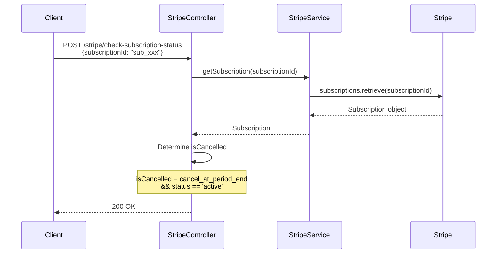
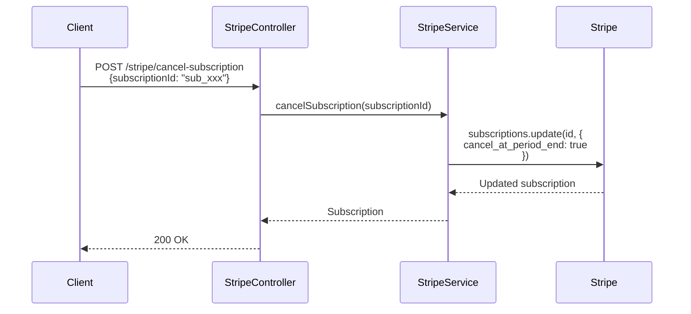
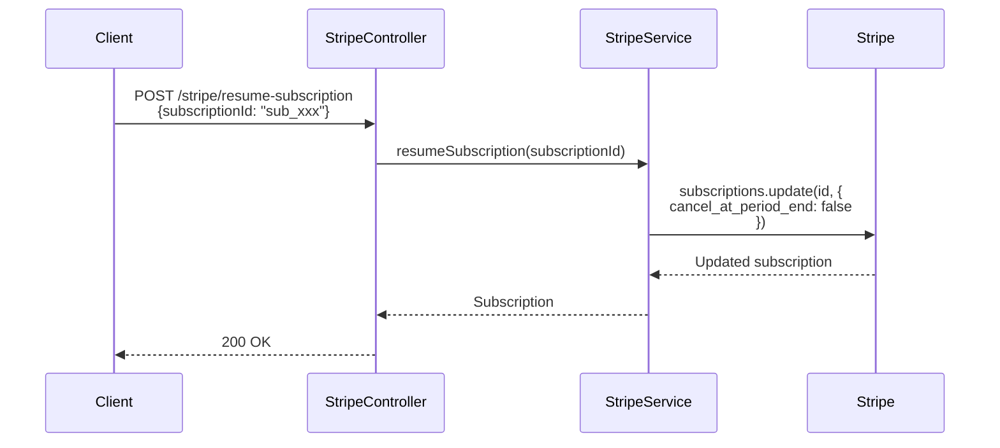
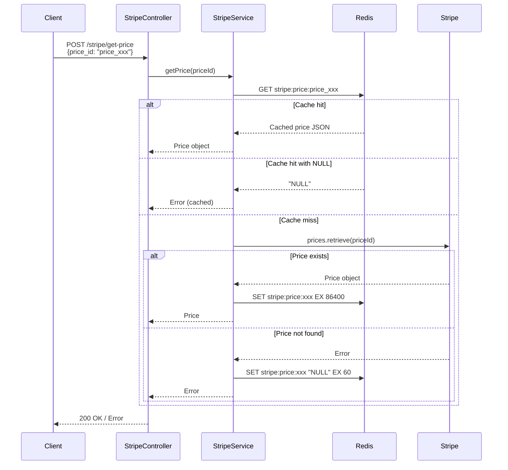

# Stripe Integration (PR #10)

Tích hợp Stripe cho payment processing với webhook handling và Redis caching.

## Architecture



---

# API: POST /stripe/stripe-checkout-session

Tạo Stripe Checkout session để user thanh toán.

## Sequence Diagram



## Request

```json
{
  "priceId": "price_xxx"
}
```

## Response

```json
{
  "url": "https://checkout.stripe.com/c/pay/xxx",
  "sessionId": "cs_xxx"
}
```

## Implementation

```typescript
// stripe.controller.ts
@UseGuards(JwtAuthGuard)
@Post('stripe-checkout-session')
async createCheckoutSession(
  @Body() dto: CreateCheckoutSessionDto,
  @Req() req: IRequest,
) {
  const customerEmail = req.user?.email
  const customerName = req.user?.name
  const userId = req.user?._id?.toString()

  if (!userId) {
    throw new BadRequestException('User authentication failed')
  }

  return this.stripeService.createCheckoutSession(
    dto.priceId,
    customerEmail,
    customerName,
    userId,
  )
}
```

```typescript
// stripe.service.ts
async createCheckoutSession(
  priceId: string,
  customerEmail?: string,
  customerName?: string,
  userId?: string,
): Promise<{ url: string; sessionId: string }> {
  const sessionParams: Stripe.Checkout.SessionCreateParams = {
    payment_method_types: ['card'],
    mode: 'subscription',
    line_items: [{ price: priceId, quantity: 1 }],
    success_url: this.configService.get('stripe.successUrl'),
    cancel_url: this.configService.get('stripe.cancelUrl'),
    billing_address_collection: 'required',
    shipping_address_collection: { allowed_countries: ['SG'] },
  }

  if (customerEmail) sessionParams.customer_email = customerEmail
  if (userId) sessionParams.metadata = { userId }

  const session = await this.stripe.checkout.sessions.create(sessionParams)
  return { url: session.url, sessionId: session.id }
}
```

---

# API: POST /stripe/webhook

Handle Stripe webhook events.

## Sequence Diagram



## Webhook Events Handled

| Event | Action |
|-------|--------|
| `checkout.session.completed` | Create/update subscription |
| `invoice.payment_failed` | Log warning |

## Implementation

```typescript
// stripe.controller.ts
@Post('webhook')
async handleWebhook(
  @Headers('stripe-signature') signature: string,
  @Req() req: Request,
) {
  const payload = req.body as Buffer
  const event = await this.stripeService.handleWebhook(payload, signature)

  switch (event.type) {
    case 'checkout.session.completed':
      const session = event.data.object
      
      // Get session with line items
      const fullSession = await this.stripeService.getSessionWithLineItems(session.id)
      const priceId = fullSession.line_items?.data?.[0]?.price?.id
      
      // Find matching plan
      const latestPlans = await this.planService.getLatestVersion()
      const plansData = JSON.parse(latestPlans.plans)
      const matchingPlan = plansData.plans.find(p => p.priceId === priceId)
      
      const userId = fullSession.metadata?.userId
      const stripeSubscriptionId = fullSession.subscription as string
      const stripeCustomerId = fullSession.customer as string
      
      // Create or update subscription
      const existingSubscription = await this.subscriptionService.findByUser(userId)
      const endDate = new Date()
      endDate.setMonth(endDate.getMonth() + 1)
      
      if (existingSubscription) {
        await this.subscriptionService.updateByUser(userId, {
          endDate,
          stripeSubscriptionId,
          stripeCustomerId,
          'quota.batchDuration': matchingPlan.batchDuration,
          'quota.liveDuration': matchingPlan.liveDuration,
        })
      } else {
        await this.subscriptionService.create({
          user: userId,
          stripeSubscriptionId,
          stripeCustomerId,
          quota: {
            batchDuration: matchingPlan.batchDuration,
            liveDuration: matchingPlan.liveDuration,
          },
          usage: { batchDuration: 0, liveDuration: 0 },
          startDate: new Date(),
          endDate,
        })
      }
      break

    case 'invoice.payment_failed':
      this.logger.warn('Payment failed:', event.data.object.id)
      break
  }

  return { received: true }
}
```

---

# API: POST /stripe/check-subscription-status

Kiểm tra trạng thái subscription trên Stripe.

## Sequence Diagram



## Response

```json
{
  "subscriptionId": "sub_xxx",
  "status": "active",
  "isCancelled": true,
  "canceledAt": 1705564800,
  "cancelAtPeriodEnd": true,
  "cancelAt": 1706169600,
  "currentPeriodEnd": 1706169600,
  "cancellationDetails": { "reason": "cancellation_requested" }
}
```

---

# API: POST /stripe/cancel-subscription

Cancel subscription (sẽ kết thúc ở cuối billing period).

## Sequence Diagram



## Response

```json
{
  "subscriptionId": "sub_xxx",
  "status": "active",
  "cancelAt": 1706169600,
  "cancelAtPeriodEnd": true,
  "currentPeriodEnd": 1706169600,
  "message": "Subscription will be cancelled at the end of the current billing period"
}
```

## Implementation

```typescript
// stripe.service.ts
async cancelSubscription(subscriptionId: string): Promise<Stripe.Subscription> {
  return this.stripe.subscriptions.update(subscriptionId, {
    cancel_at_period_end: true,
  })
}
```

---

# API: POST /stripe/resume-subscription

Resume subscription đã bị cancel.

## Sequence Diagram



## Response

```json
{
  "subscriptionId": "sub_xxx",
  "status": "active",
  "cancelAt": null,
  "cancelAtPeriodEnd": false,
  "canceledAt": null,
  "currentPeriodEnd": 1706169600,
  "cancellationDetails": null
}
```

---

# API: POST /stripe/get-price

Lấy thông tin price từ Stripe (cached).

## Sequence Diagram



## Response

```json
{
  "id": "price_xxx",
  "object": "price",
  "active": true,
  "currency": "usd",
  "unit_amount": 2000,
  "unit_amount_decimal": "2000",
  "recurring": {
    "interval": "month",
    "interval_count": 1
  },
  "product": "prod_xxx"
}
```

## Redis Caching

```typescript
// stripe.service.ts
private readonly CACHE_TTL = 86400  // 24 hours

async getPrice(priceId: string): Promise<Stripe.Price> {
  const cacheKey = `stripe:price:${priceId}`
  const cached = await this.redisClient.get(cacheKey)

  if (cached) {
    if (cached === 'NULL') {
      throw new Error(`Stripe price not found (cached): ${priceId}`)
    }
    return JSON.parse(cached) as Stripe.Price
  }

  try {
    const price = await this.stripe.prices.retrieve(priceId)
    await this.redisClient.set(cacheKey, JSON.stringify(price), { EX: this.CACHE_TTL })
    return price
  } catch (error) {
    // Cache penetration protection
    if (error?.code === 'resource_missing') {
      await this.redisClient.set(cacheKey, 'NULL', { EX: 60 })
    }
    throw error
  }
}
```

---

# Configuration

```bash
# Stripe
STRIPE_SECRET_KEY=sk_xxx
STRIPE_WEBHOOK_SECRET=whsec_xxx
STRIPE_SUCCESS_URL=https://app.example.com/success
STRIPE_CANCEL_URL=https://app.example.com/cancel

# Redis
REDIS_HOST=localhost
REDIS_PORT=6379
REDIS_PASSWORD=secret
```

---

# Module Setup

```typescript
// stripe.module.ts
@Module({
  imports: [
    ConfigModule,
    SubscriptionModule,
    PlanModule,
  ],
  providers: [StripeService],
  controllers: [StripeController],
  exports: [StripeService],
})
export class StripeModule {}
```
