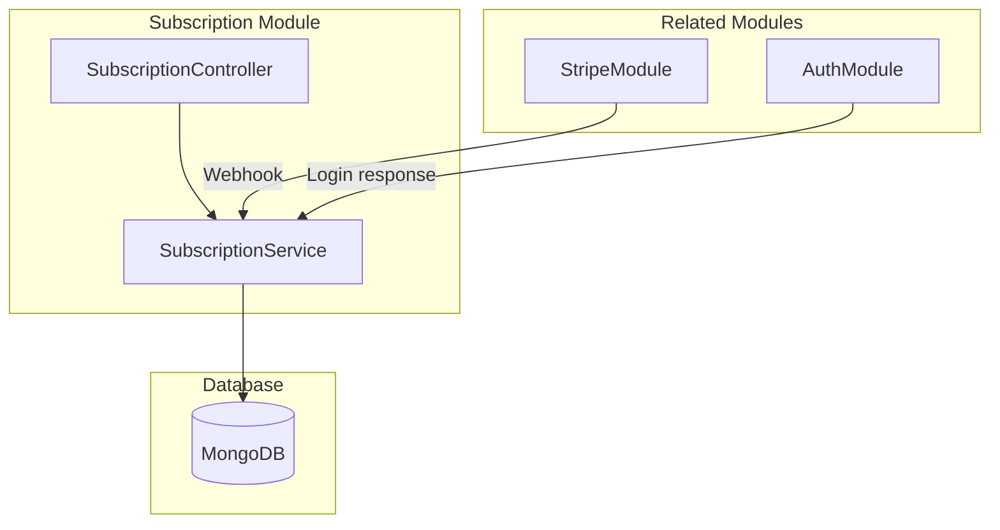
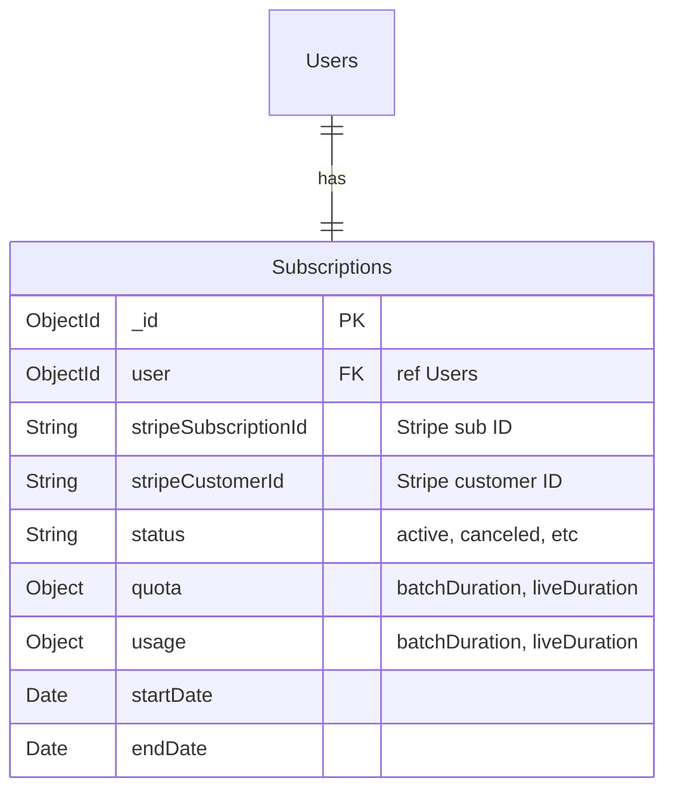
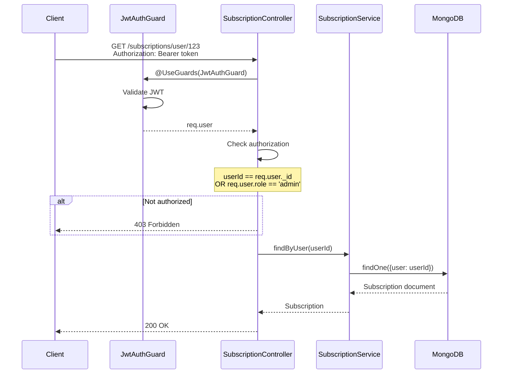
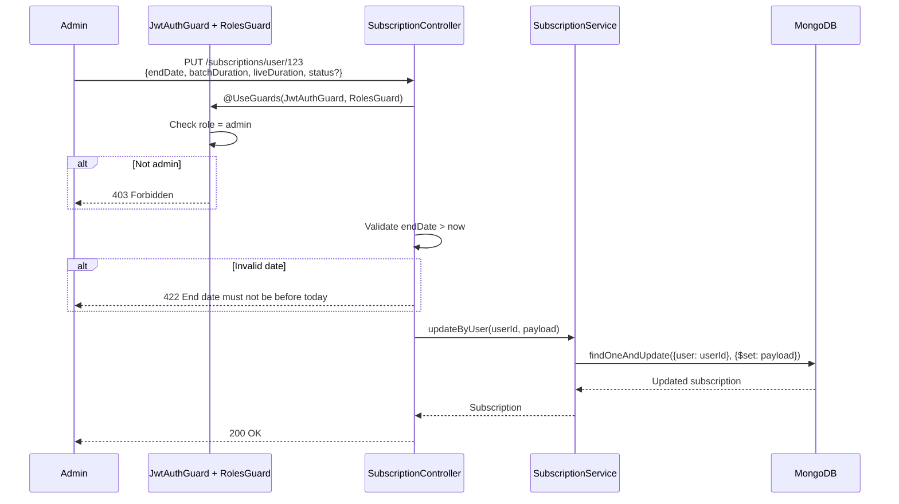
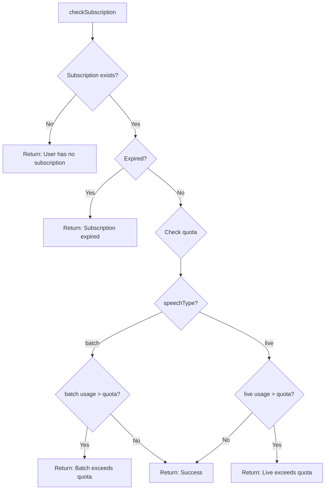

# Subscription Module (PR #10)

Quản lý subscription của users với quota tracking.

## Architecture



---

## Database Schema



### Schema Definition

```typescript
// subscription.schema.ts
@Schema({ timestamps: true })
export class Subscription extends Document {
  @Prop({ required: true, ref: User.name, type: Schema.Types.ObjectId })
  user: string | User

  @Prop({ type: String, required: false })
  stripeSubscriptionId?: string

  @Prop({ type: String, required: false })
  stripeCustomerId?: string

  @Prop({
    type: String,
    enum: ['active', 'canceled', 'incomplete', 'incomplete_expired', 
           'past_due', 'trialing', 'unpaid'],
    default: 'active',
  })
  status: string

  @Prop(raw({
    batchDuration: { type: Number, default: -1 },  // -1 = unlimited
    liveDuration: { type: Number, default: -1 },
  }))
  quota: SubscriptionUnit

  @Prop(raw({
    batchDuration: { type: Number, default: 0 },
    liveDuration: { type: Number, default: 0 },
  }))
  usage: SubscriptionUnit

  @Prop({ type: Date, default: new Date() })
  startDate: Date

  @Prop({ type: Date, default: () => new Date(+new Date() + 7*24*60*60*1000) })
  endDate: Date  // Default: 7 days trial
}
```

### Quota Values

| Value | Meaning |
|-------|---------|
| `-1` | Unlimited |
| `0` | No access |
| `> 0` | Seconds allowed |

### Sample Document

```json
{
  "_id": "64a1b2c3d4e5f6g7h8i9j0k1",
  "user": "64a1b2c3d4e5f6g7h8i9j0k2",
  "stripeSubscriptionId": "sub_xxx",
  "stripeCustomerId": "cus_xxx",
  "status": "active",
  "quota": {
    "batchDuration": 36000,
    "liveDuration": 18000
  },
  "usage": {
    "batchDuration": 5400,
    "liveDuration": 1200
  },
  "startDate": "2024-01-01T00:00:00.000Z",
  "endDate": "2024-02-01T00:00:00.000Z"
}
```

---

# API: GET /subscriptions/user/:id

Lấy subscription của user.

## Sequence Diagram



## Response

```json
{
  "_id": "64a1b2c3d4e5f6g7h8i9j0k1",
  "user": "64a1b2c3d4e5f6g7h8i9j0k2",
  "stripeSubscriptionId": "sub_xxx",
  "status": "active",
  "quota": {
    "batchDuration": 36000,
    "liveDuration": 18000
  },
  "usage": {
    "batchDuration": 5400,
    "liveDuration": 1200
  },
  "startDate": "2024-01-01T00:00:00.000Z",
  "endDate": "2024-02-01T00:00:00.000Z"
}
```

## Implementation

```typescript
// subscription.controller.ts
@Get('/user/:id')
getSubscriptionByUser(
  @Param() params: GetSubscriptionByUserDto,
  @Req() req: IRequest,
): Promise<Subscription> {
  // User can view own subscription, admin can view any
  if (req.user._id.toString() === params.id || req.user.role === 'admin') {
    return this.subscriptionService.findByUser(params.id)
  }

  throw new ForbiddenException()
}
```

---

# API: PUT /subscriptions/user/:id

Cập nhật subscription của user (Admin only).

## Sequence Diagram



## Request

```json
{
  "endDate": "2024-03-01T00:00:00.000Z",
  "batchDuration": 72000,
  "liveDuration": 36000,
  "status": "active"
}
```

## Response

```json
{
  "_id": "64a1b2c3d4e5f6g7h8i9j0k1",
  "user": "64a1b2c3d4e5f6g7h8i9j0k2",
  "status": "active",
  "quota": {
    "batchDuration": 72000,
    "liveDuration": 36000
  },
  "endDate": "2024-03-01T00:00:00.000Z"
}
```

## Implementation

```typescript
// subscription.controller.ts
@UseGuards(RolesGuard)
@Roles(Role.Admin)
@Put('/user/:id')
updateSubscriptionByUser(
  @Body() body: UpdateSubscriptionByUserDto,
  @Param() params: GetSubscriptionByUserDto,
): Promise<Subscription> {
  const endDate = new Date(body.endDate)
  const now = new Date()

  if (endDate < now) {
    throw new UnprocessableEntityException('End date must not be before today')
  }

  const updatePayload: Record<string, any> = {
    endDate: new Date(body.endDate),
    'quota.batchDuration': body.batchDuration,
    'quota.liveDuration': body.liveDuration,
  }

  if (body.status) {
    updatePayload.status = body.status
  }

  return this.subscriptionService.updateByUser(params.id, updatePayload, true)
}
```

---

# checkSubscription Method

Kiểm tra user có quyền sử dụng service không.

## Flow Diagram



## Implementation

```typescript
// subscription.service.ts
async checkSubscription(
  userId: string,
  speechType?: 'live' | 'batch',
  payload?: SubscriptionUnit,
): Promise<{ success: boolean; message: string; subscription?: Subscription }> {
  const sub = await this.subscriptionModel.findOne({ user: userId }).exec()

  if (!sub) {
    return { success: false, message: 'User has no subscription' }
  }

  if (new Date() > sub.endDate) {
    return { success: false, message: 'Subscription has been expired' }
  }

  // Check batch quota (if not unlimited)
  if (speechType === 'batch' && sub.quota.batchDuration !== -1) {
    const wouldExceed = payload
      ? sub.usage.batchDuration + payload.batchDuration > sub.quota.batchDuration
      : sub.usage.batchDuration > sub.quota.batchDuration
    
    if (wouldExceed) {
      return { success: false, message: 'Batch subscription exceeds quota' }
    }
  }

  // Check live quota (if not unlimited)
  if (speechType === 'live' && sub.quota.liveDuration !== -1) {
    const wouldExceed = payload
      ? sub.usage.liveDuration + payload.liveDuration > sub.quota.liveDuration
      : sub.usage.liveDuration > sub.quota.liveDuration
    
    if (wouldExceed) {
      return { success: false, message: 'Live subscription exceeds quota' }
    }
  }

  return { success: true, message: null, subscription: sub }
}
```

---

# Module Setup

```typescript
// subscription.module.ts
@Module({
  imports: [
    MongooseModule.forFeature([
      { name: Subscription.name, schema: SubscriptionSchema }
    ]),
  ],
  providers: [SubscriptionService],
  controllers: [SubscriptionController],
  exports: [SubscriptionService],
})
export class SubscriptionModule {}
```
