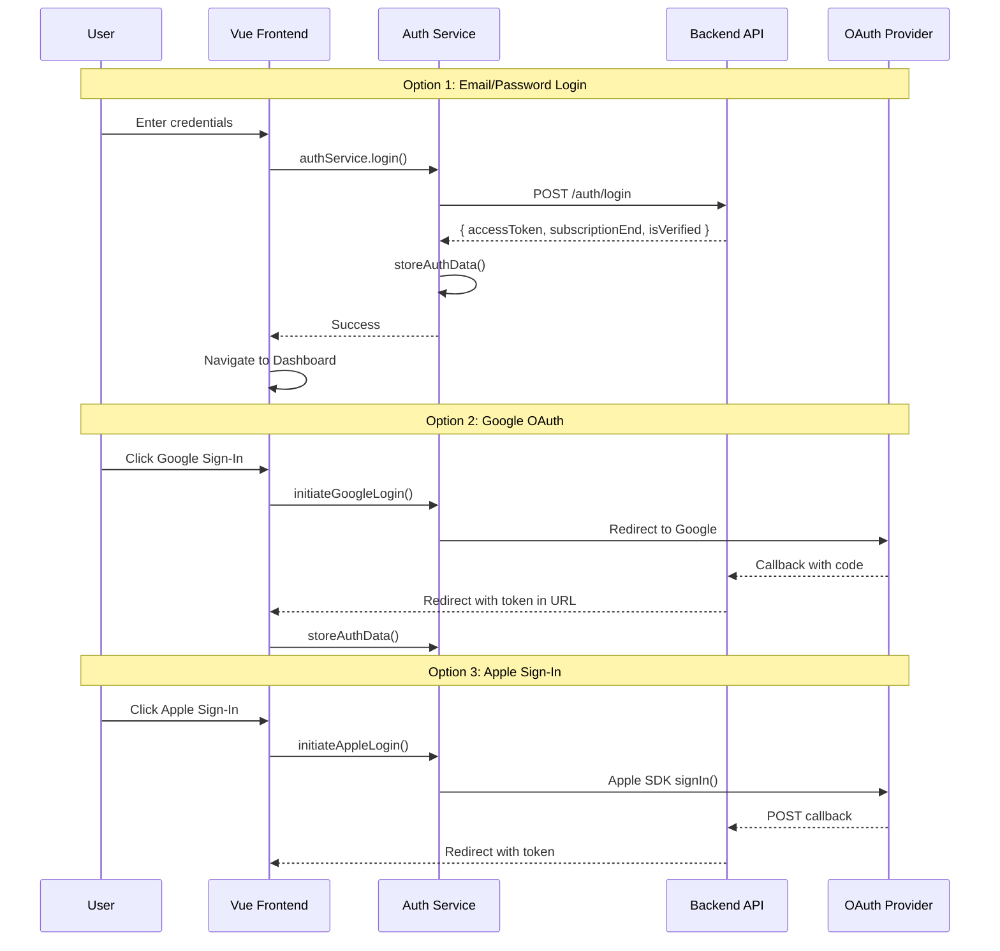
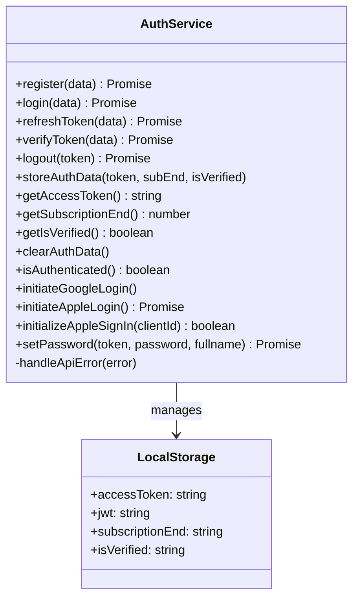
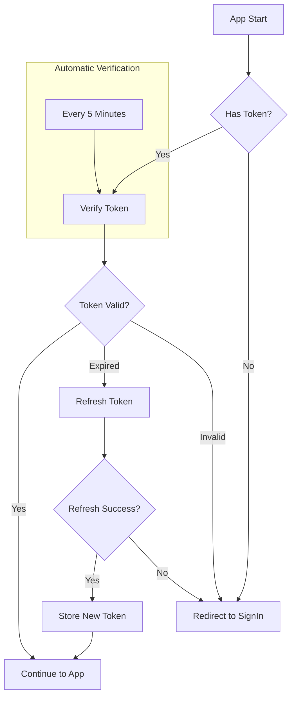
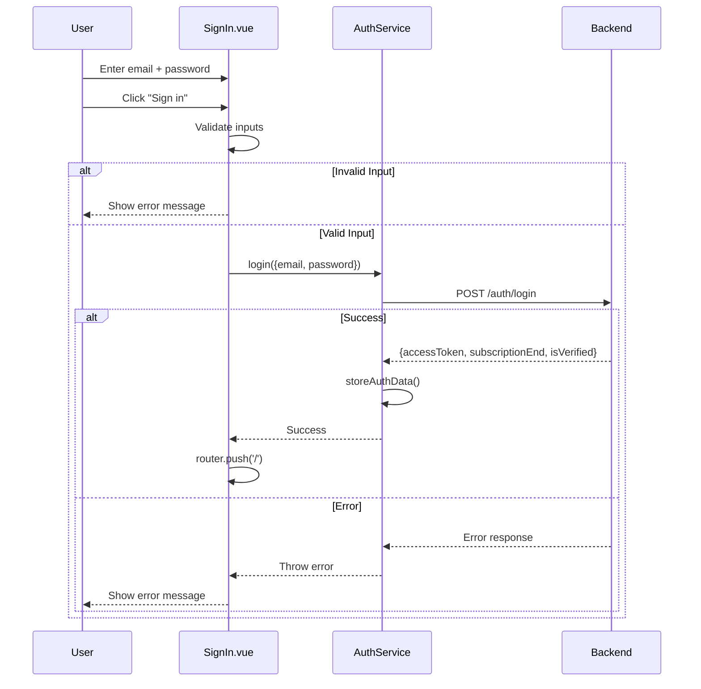
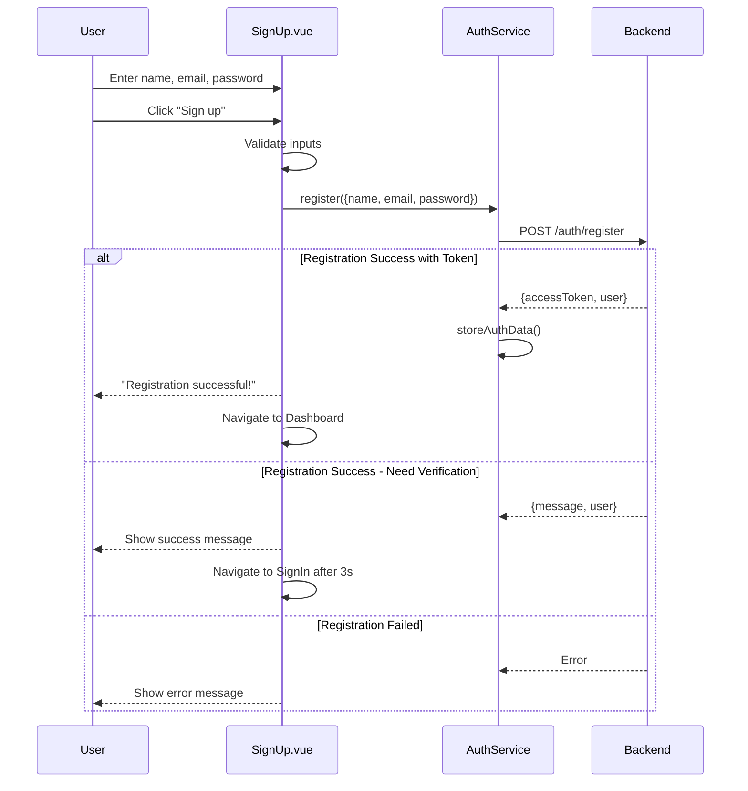
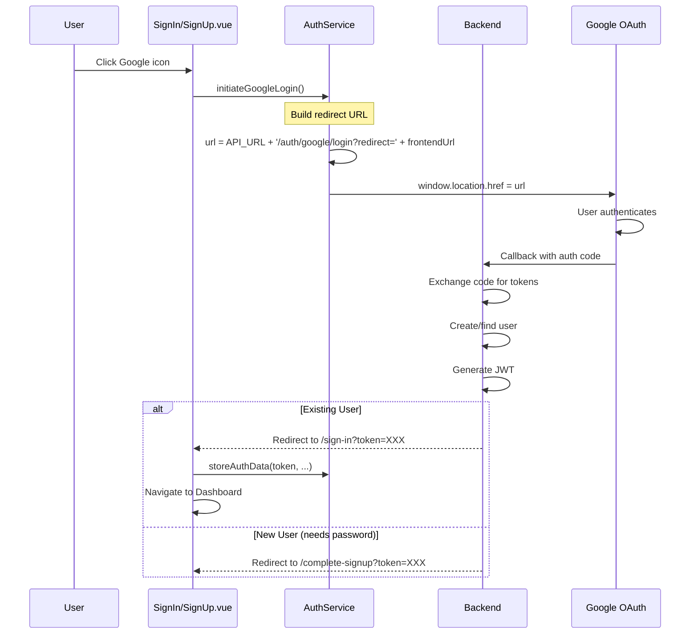
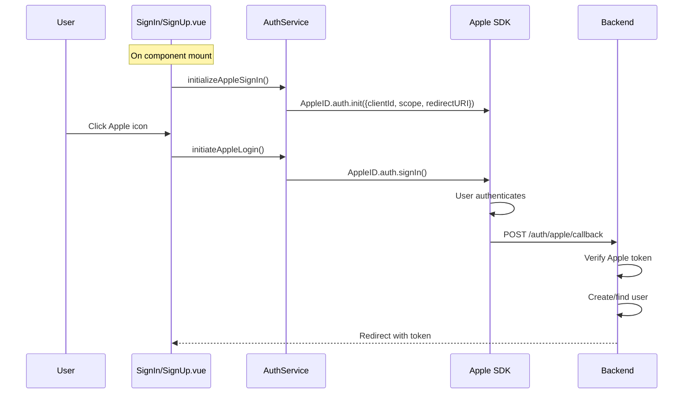
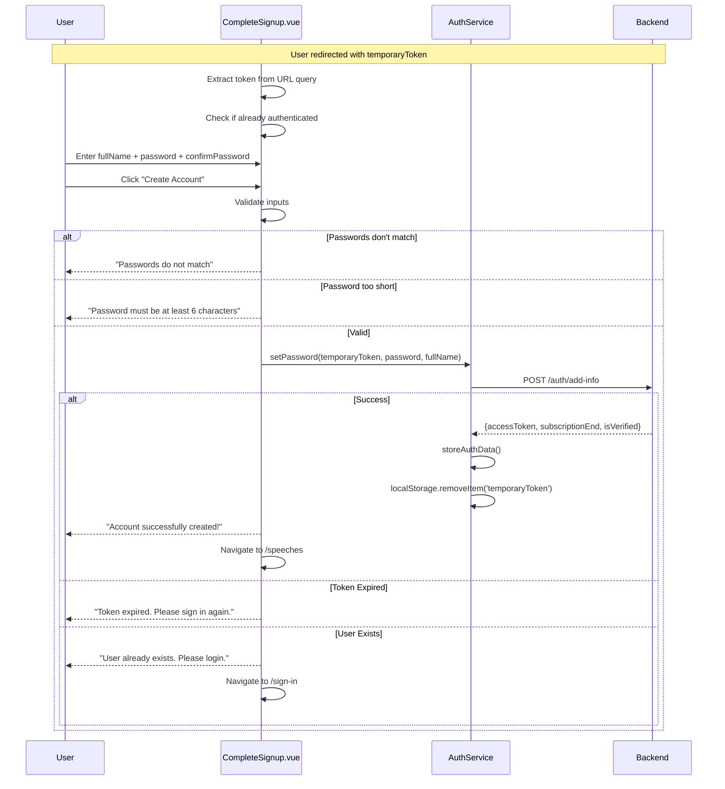
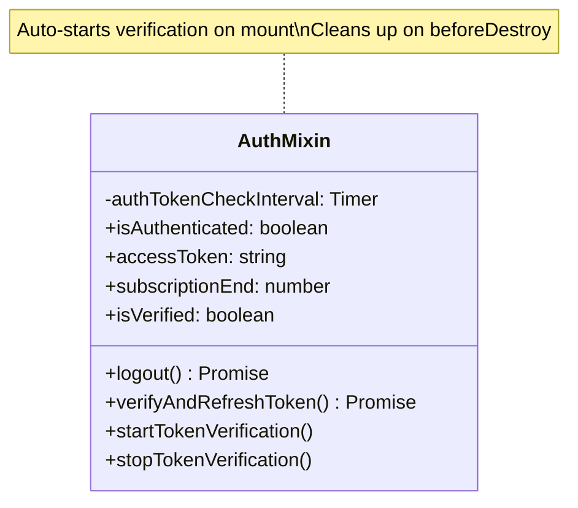

# Authentication System

## Tổng Quan

Hệ thống authentication hỗ trợ 3 phương thức đăng nhập:
- **Email/Password**: Đăng ký và đăng nhập truyền thống
- **Google OAuth 2.0**: Redirect-based OAuth flow
- **Apple Sign-In**: SDK-based với redirect callback

---

## 1. Authentication Flow Overview



---

## 2. Auth Service Architecture

### 2.1 Class Diagram



### 2.2 Methods Detail

| Method | Description | Params | Returns |
|--------|-------------|--------|---------|
| `register` | Đăng ký tài khoản mới | `{name, email, password}` | `{message, user?}` |
| `login` | Đăng nhập email/password | `{email, password}` | `{accessToken, subscriptionEnd, isVerified}` |
| `refreshToken` | Làm mới token hết hạn | `{token}` | `{accessToken, subscriptionEnd, isVerified}` |
| `verifyToken` | Xác thực token | `{token}` | `{valid, expired?, message?}` |
| `logout` | Đăng xuất và revoke token | `token` | `{message}` |
| `setPassword` | Hoàn tất OAuth signup | `token, password, fullname` | `{accessToken, ...}` |

---

## 3. Token Management

### 3.1 Token Lifecycle



### 3.2 Storage Schema

```javascript
// LocalStorage keys
{
  accessToken: "eyJhbGciOiJIUzI1NiIsInR5cCI6IkpXVCJ9...",
  jwt: "eyJhbGciOiJIUzI1NiIsInR5cCI6IkpXVCJ9...", // backward compat
  subscriptionEnd: "1737244800000", // Unix timestamp (ms)
  isVerified: "true"
}
```

### 3.3 Automatic Token Refresh

```javascript
// main.js - Token verification interval
if (authService.isAuthenticated()) {
  app.verifyAndRefreshToken()
  setInterval(() => {
    app.verifyAndRefreshToken()
  }, 5 * 60 * 1000) // Every 5 minutes
}
```

---

## 4. Email/Password Authentication

### 4.1 Login Flow



### 4.2 Registration Flow



---

## 5. OAuth Authentication

### 5.1 Google OAuth Flow



### 5.2 Apple Sign-In Flow



### 5.3 OAuth Complete Signup

Khi user đăng nhập OAuth lần đầu, cần complete signup bằng cách đặt password:



---

## 6. Apple Sign-In SDK Initialization

```javascript
// auth.service.js
initializeAppleSignIn(clientId) {
  if (!window.AppleID) {
    console.warn('Apple Sign-In SDK not loaded yet')
    return false
  }

  try {
    const appleClientId = clientId || process.env.VUE_APP_APPLE_CLIENT_ID

    window.AppleID.auth.init({
      clientId: appleClientId,           // 'sg.speechlab.gateway'
      scope: 'name email',
      redirectURI: `${API_URL}/auth/apple/callback`,
      usePopup: false                     // Use redirect mode
    })
    return true
  } catch (error) {
    console.error('Failed to initialize Apple Sign-In:', error)
    return false
  }
}
```

---

## 7. Auth Mixin

Vue mixin cung cấp authentication functionality cho components:



### Usage

```javascript
import { authMixin } from '@/mixins/auth.mixin'

export default {
  mixins: [authMixin],
  // Component now has access to:
  // - this.isAuthenticated
  // - this.accessToken
  // - this.logout()
  // - etc.
}
```

---

## 8. Related Files

| File | Description |
|------|-------------|
| [auth.service.js](file:///home/linh/Workspaces/gateway-dashboard/src/services/auth.service.js) | Core auth service |
| [auth.mixin.js](file:///home/linh/Workspaces/gateway-dashboard/src/mixins/auth.mixin.js) | Auth mixin for components |
| [SignIn.vue](file:///home/linh/Workspaces/gateway-dashboard/src/views/SignIn.vue) | Login page |
| [SignUp.vue](file:///home/linh/Workspaces/gateway-dashboard/src/views/SignUp.vue) | Registration page |
| [CompleteSignup.vue](file:///home/linh/Workspaces/gateway-dashboard/src/views/CompleteSignup.vue) | OAuth completion page |
| [main.js](file:///home/linh/Workspaces/gateway-dashboard/src/main.js) | Token verification setup |

---

*[← Back to Index](./README.md)*
