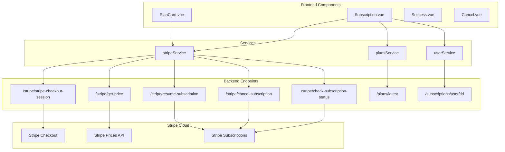
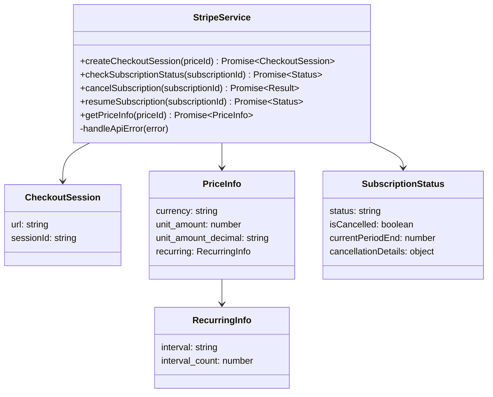
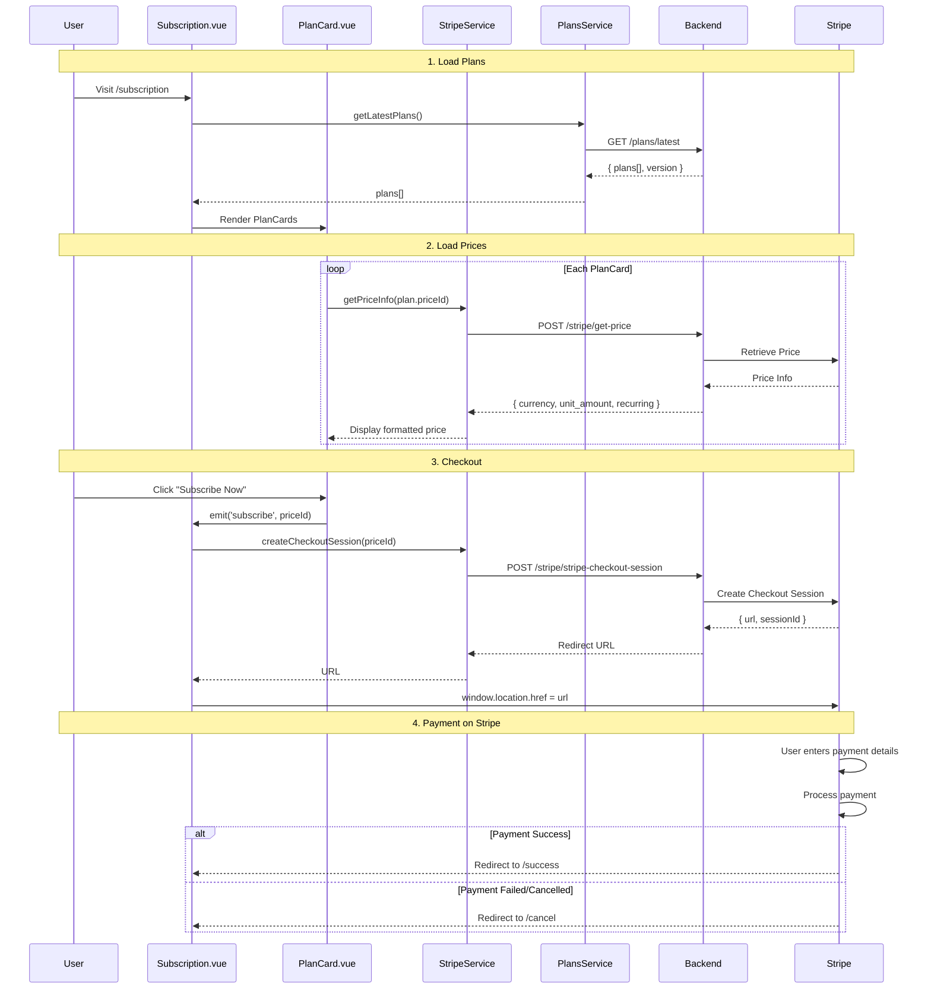
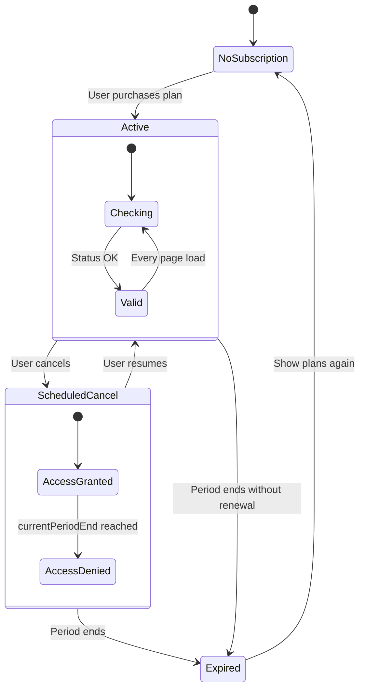
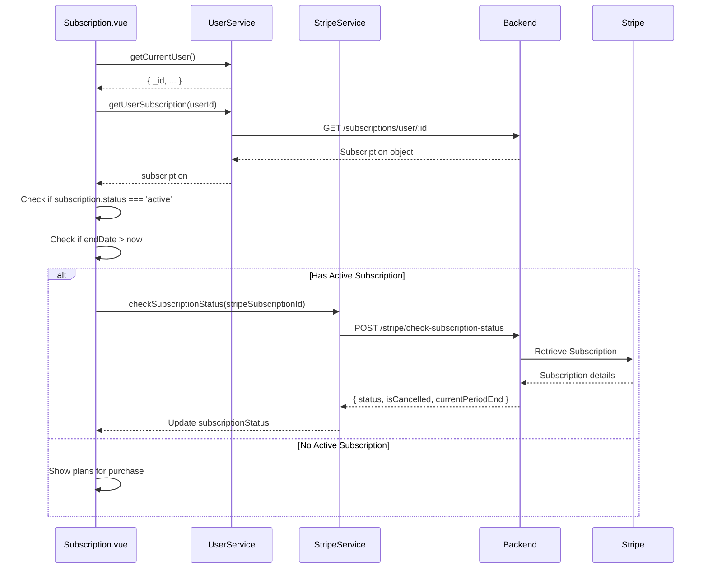
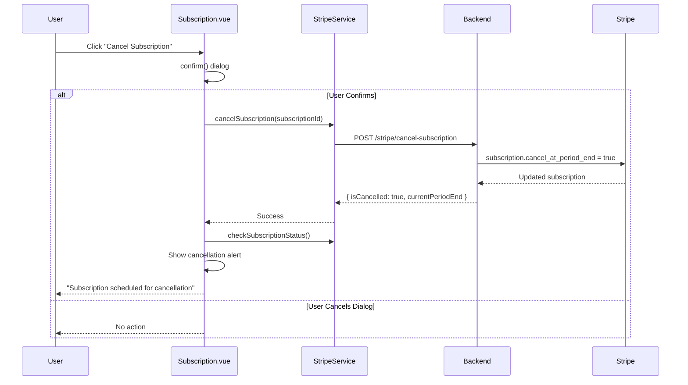
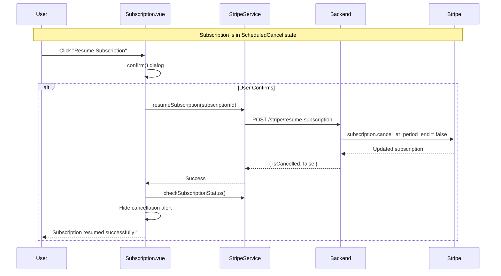
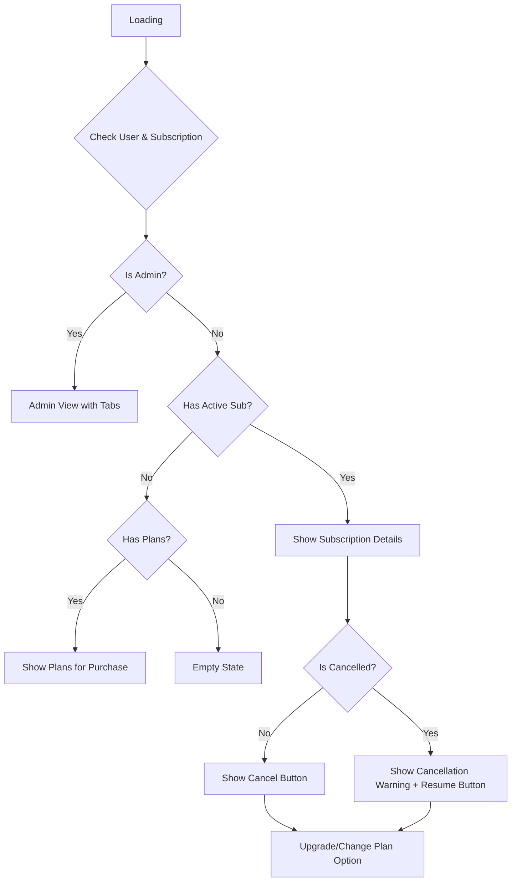

# Subscription & Payment System

## Tổng Quan

Hệ thống payment sử dụng **Stripe** để xử lý subscriptions. Các tính năng chính:
- Hiển thị plans với giá từ Stripe
- Checkout flow với Stripe Checkout
- Cancel/Resume subscriptions
- Subscription status tracking

---

## 1. System Architecture



---

## 2. Stripe Service

### 2.1 Class Diagram



### 2.2 Methods Detail

| Method | HTTP | Endpoint | Auth | Description |
|--------|------|----------|------|-------------|
| `createCheckoutSession` | POST | `/stripe/stripe-checkout-session` | ✅ | Tạo Stripe Checkout session |
| `checkSubscriptionStatus` | POST | `/stripe/check-subscription-status` | ✅ | Kiểm tra trạng thái subscription |
| `cancelSubscription` | POST | `/stripe/cancel-subscription` | ✅ | Hủy subscription (at period end) |
| `resumeSubscription` | POST | `/stripe/resume-subscription` | ✅ | Resume subscription đã hủy |
| `getPriceInfo` | POST | `/stripe/get-price` | ❌ | Lấy thông tin giá từ Stripe |

---

## 3. Subscription Purchase Flow

### 3.1 Complete Flow



### 3.2 Price Display Logic

```javascript
// PlanCard.vue
computed: {
  formattedPrice() {
    if (!this.priceInfo) return 'N/A'
    
    // Convert from cents to dollar
    const amount = this.priceInfo.unit_amount_decimal
      ? (parseInt(this.priceInfo.unit_amount_decimal) / 100).toFixed(2)
      : (this.priceInfo.unit_amount / 100).toFixed(2)
    
    const currency = this.priceInfo.currency.toUpperCase()
    return `${currency} $${amount}`
  },
  
  billingInterval() {
    if (!this.priceInfo?.recurring) return 'one-time'
    return this.priceInfo.recurring.interval // 'month' or 'year'
  }
}
```

---

## 4. Subscription Status Management

### 4.1 State Diagram



### 4.2 Status Check Flow



---

## 5. Cancel & Resume

### 5.1 Cancel Flow



### 5.2 Resume Flow



---

## 6. Subscription View States

### 6.1 State Machine



### 6.2 UI Components

```
┌────────────────────────────────────────────────────────────┐
│                    Your Subscription                       │
│                      ┌─────────┐                           │
│                      │ Active  │                           │
│                      └─────────┘                           │
├────────────────────────────────────────────────────────────┤
│ ⚠️ Subscription Scheduled for Cancellation                 │
│ Your subscription will end on January 31, 2026             │
│ You can resume anytime before this date.                   │
├────────────────────────────────────────────────────────────┤
│ Subscription Period                                        │
│ Start Date: January 1, 2026    End Date: January 31, 2026  │
├────────────────────────────────────────────────────────────┤
│ ┌─────────────────────┐  ┌─────────────────────┐          │
│ │   Batch Processing  │  │   Live Processing   │          │
│ │   Quota: 10 hours   │  │   Quota: 5 hours    │          │
│ │   Used: 3 hours     │  │   Used: 1 hour      │          │
│ │   ████████░░░ 30%   │  │   ████░░░░░░ 20%    │          │
│ └─────────────────────┘  └─────────────────────┘          │
├────────────────────────────────────────────────────────────┤
│  [Upgrade or Change Plan]    [Resume Subscription]         │
└────────────────────────────────────────────────────────────┘
```

---

## 7. User Service - Subscription Methods

```javascript
// user.service.js
async getUserSubscription(userId) {
  try {
    const response = await http.get(`/subscriptions/user/${userId}`)
    return response.data
  } catch (error) {
    // Return null if subscription not found (404)
    if (error.response?.status === 404) {
      return null
    }
    return this.handleApiError(error)
  }
}
```

### Subscription Object Schema

```typescript
interface Subscription {
  _id: string
  userId: string
  planId: string
  stripeSubscriptionId: string  // Reference to Stripe
  status: 'active' | 'cancelled' | 'expired'
  startDate: string             // ISO date
  endDate: string               // ISO date
  quota: {
    batchDuration: number       // seconds, -1 = unlimited
    liveDuration: number        // seconds, -1 = unlimited
  }
  usage: {
    batchDuration: number       // seconds used
    liveDuration: number        // seconds used
  }
}
```

---

## 8. Success & Cancel Pages

### 8.1 Success Page

```mermaid
flowchart LR
    A[Stripe Checkout] -->|Payment Success| B[/success]
    B --> C[Display Success Message]
    C --> D[Return to Home Button]
    D --> E[Navigate to Dashboard]
```

### 8.2 Cancel Page

```mermaid
flowchart LR
    A[Stripe Checkout] -->|User Cancels| B[/cancel]
    B --> C[Display Cancel Message]
    C --> D[Return to Home]
    C --> E[Try Again]
    E --> F[Go Back to Previous Page]
```

---

## 9. Related Files

| File | Description |
|------|-------------|
| [stripe.service.js](file:///home/linh/Workspaces/gateway-dashboard/src/services/stripe.service.js) | Stripe API integration |
| [user.service.js](file:///home/linh/Workspaces/gateway-dashboard/src/services/user.service.js) | User & subscription queries |
| [Subscription.vue](file:///home/linh/Workspaces/gateway-dashboard/src/views/Subscription.vue) | Main subscription page |
| [PlanCard.vue](file:///home/linh/Workspaces/gateway-dashboard/src/components/PlanCard.vue) | Plan display component |
| [Success.vue](file:///home/linh/Workspaces/gateway-dashboard/src/views/Success.vue) | Payment success page |
| [Cancel.vue](file:///home/linh/Workspaces/gateway-dashboard/src/views/Cancel.vue) | Payment cancelled page |

---

*[← Back to Index](./README.md)*
