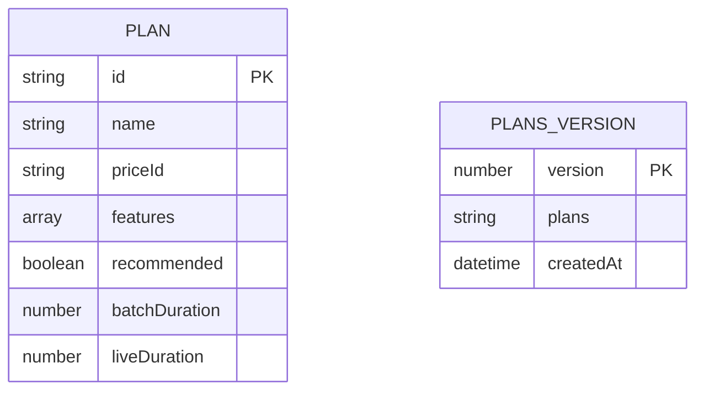
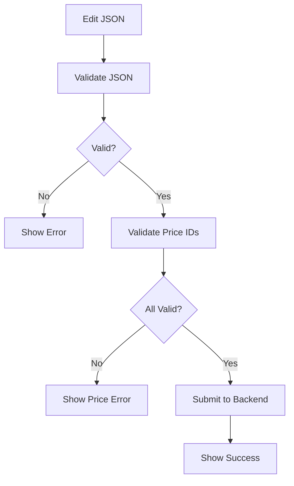

# Plans Management System

## Tổng Quan

Hệ thống Plans Management cho phép Admin tạo, chỉnh sửa plans dưới dạng JSON với validation và diff comparison.

---

## 1. Data Model



### Plan Schema

```json
{
  "id": "basic-plan-001",
  "name": "Basic",
  "features": ["Feature 1", "Feature 2"],
  "priceId": "price_1SHpG27ulmHU5ctwMzG3Id2C",
  "recommended": false,
  "batchDuration": 1800,
  "liveDuration": 3600
}
```

---

## 2. Plans Service

| Method | Endpoint | Auth | Description |
|--------|----------|------|-------------|
| `getLatestPlans` | `GET /plans/latest` | ❌ | Lấy plans mới nhất |
| `createPlans` | `POST /plans` | ✅ Admin | Tạo plans mới |

---

## 3. Admin Editor Flow



---

## 4. Validation Rules

- `id`: required string
- `name`: required string  
- `priceId`: required, must be valid Stripe Price ID
- `features`: required, non-empty array
- `batchDuration`: optional, positive number or -1
- `liveDuration`: optional, positive number or -1

---

## 5. Related Files

| File | Description |
|------|-------------|
| [plans.service.js](file:///home/linh/Workspaces/gateway-dashboard/src/services/plans.service.js) | Plans API |
| [JsonPlansEditor.vue](file:///home/linh/Workspaces/gateway-dashboard/src/views/admin/JsonPlansEditor.vue) | Editor component |

*[← Back to Index](./README.md)*
