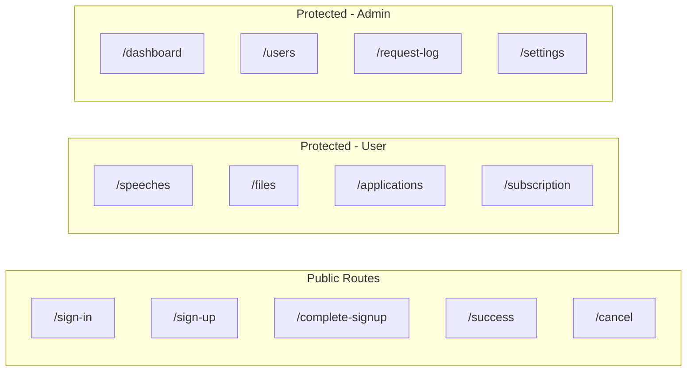
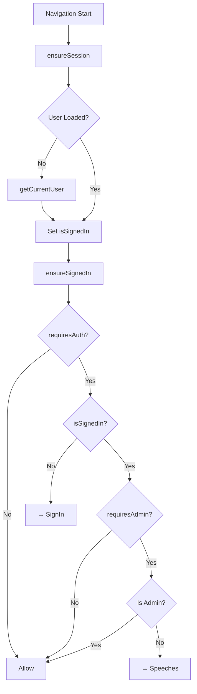

# Routing & Navigation

## 1. Route Configuration



---

## 2. Route Definitions

| Path | Name | Auth | Admin | Component |
|------|------|------|-------|-----------|
| `/` | Dashboard | ✅ | ✅ | Dashboard.vue |
| `/speeches` | Speeches | ✅ | ❌ | Speeches.vue |
| `/files` | Files | ✅ | ❌ | Files.vue |
| `/applications` | Applications | ✅ | ❌ | Applications.vue |
| `/users` | Users | ✅ | ✅ | Users.vue |
| `/request-log` | RequestLog | ✅ | ✅ | RequestLog.vue |
| `/settings` | Settings | ✅ | ✅ | Settings.vue |
| `/subscription` | Subscription | ✅ | ❌ | Subscription.vue |
| `/sign-in` | SignIn | ❌ | ❌ | SignIn.vue |
| `/sign-up` | SignUp | ❌ | ❌ | SignUp.vue |
| `/complete-signup` | CompleteSignup | ❌ | ❌ | CompleteSignup.vue |
| `/success` | Success | ❌ | ❌ | Success.vue |
| `/cancel` | Cancel | ❌ | ❌ | Cancel.vue |

---

## 3. Navigation Guards



---

## 4. Guard Implementation

```javascript
// ensureSession - Load user if needed
export const ensureSession = router => async (to, from, next) => {
  await Vue.nextTick()
  
  if (!router.app.user && to.name !== 'SignIn') {
    const user = await router.app.getCurrentUser()
    to.meta.isSignedIn = !!user
  } else {
    to.meta.isSignedIn = router.app.user !== null
  }
  next()
}

// ensureSignedIn - Check auth and admin
export const ensureSignedIn = router => (to, from, next) => {
  const requiresAdmin = anyTrue(to, 'requiresAdmin')
  const requiresAuth = requiresAdmin || anyTrue(to, 'requiresAuth')
  
  if (requiresAuth) {
    if (!to.meta.isSignedIn) {
      next({ name: 'SignIn' })
    } else if (requiresAdmin && router.app.user.role !== 'admin') {
      next({ name: 'Speeches' })
    } else {
      next()
    }
  } else {
    next()
  }
}
```

---

## 5. Related Files

| File | Description |
|------|-------------|
| [router/index.js](file:///home/linh/Workspaces/gateway-dashboard/src/router/index.js) | Route definitions |
| [router/hooks.js](file:///home/linh/Workspaces/gateway-dashboard/src/router/hooks.js) | Navigation guards |

*[← Back to Index](./README.md)*
