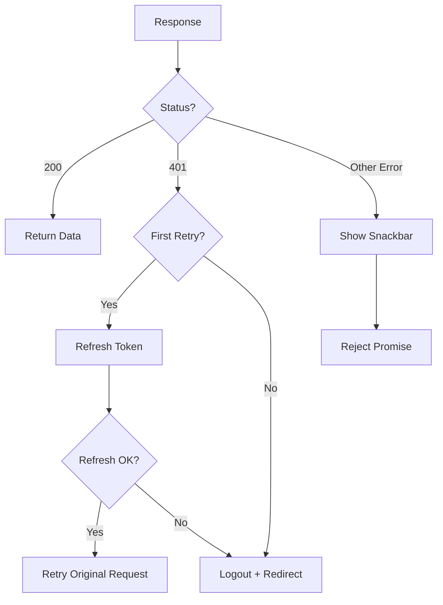

# HTTP Client & Error Handling

## 1. Axios Configuration

```javascript
// http.js
const http = axios.create({
  baseURL: process.env.VUE_APP_GATEWAY_URL,
  headers: {
    Authorization: `Bearer ${authService.getAccessToken()}`,
    'Content-Type': 'application/json'
  }
})
```

---

## 2. Request Interceptor

```mermaidhttps://github.com/ntuspeechlab/gateway-dashboard/pull/1/files
sequenceDiagram
    participant C as Component
    participant HTTP as Axios
    participant REQ as Request Interceptor
    participant AS as AuthService
    participant BE as Backend
    
    C->>HTTP: Make Request
    HTTP->>REQ: Process Request
    REQ->>AS: getAccessToken()
    AS-->>REQ: token
    REQ->>REQ: Add Authorization header
    REQ->>BE: Send Request
```

```javascript
http.interceptors.request.use((config) => {
  const token = authService.getAccessToken()
  if (token) {
    config.headers.Authorization = `Bearer ${token}`
  }
  return config
})
```

---

## 3. Response Interceptor



---

## 4. Token Refresh Logic

```javascript
if (error.response.status === 401 && !originalRequest._retry) {
  originalRequest._retry = true
  
  try {
    const token = authService.getAccessToken()
    const refreshResult = await authService.refreshToken({ token })
    authService.storeAuthData(
      refreshResult.accessToken,
      refreshResult.subscriptionEnd,
      refreshResult.isVerified
    )
    
    // Retry with new token
    originalRequest.headers.Authorization = `Bearer ${refreshResult.accessToken}`
    return http(originalRequest)
  } catch (refreshError) {
    authService.clearAuthData()
    router.push({ name: 'SignIn' })
    return Promise.reject(refreshError)
  }
}
```

---

## 5. Error Display

```javascript
// Show error in global snackbar
app.$data.snackbar.message = error.response?.data?.message || error.message
app.$data.snackbar.isVisible = true
app.$data.snackbar.color = 'error'
```

---

## 6. Related Files

| File | Description |
|------|-------------|
| [http.js](file:///home/linh/Workspaces/gateway-dashboard/src/http.js) | HTTP client config |
| [main.js](file:///home/linh/Workspaces/gateway-dashboard/src/main.js) | Snackbar state |

*[← Back to Index](./README.md)*
