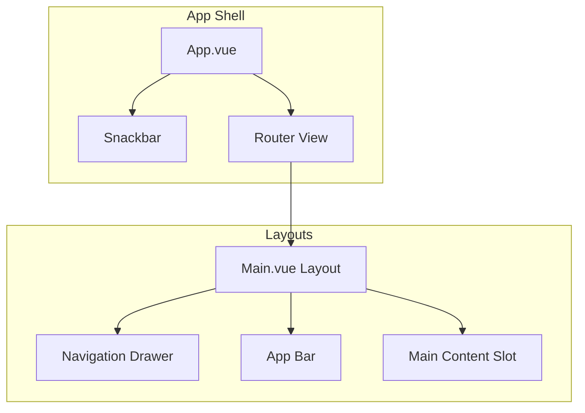
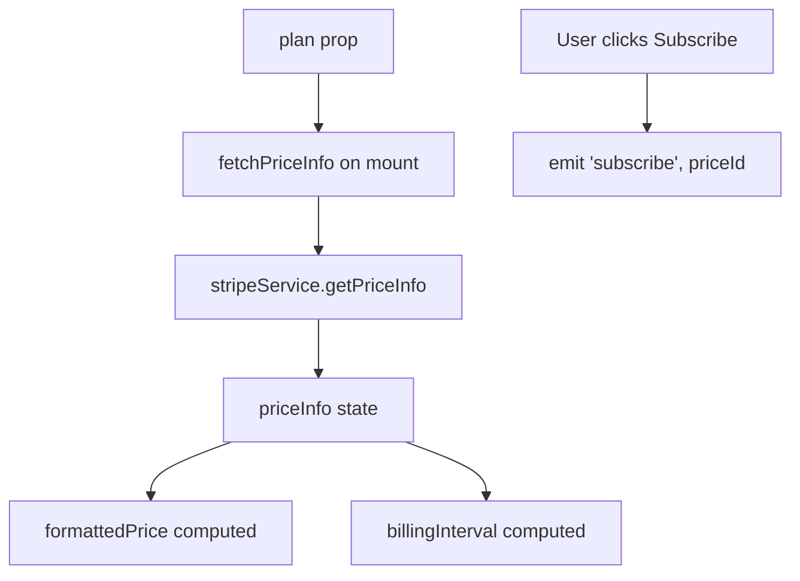

# Component Architecture

## 1. Layout Structure



---

## 2. Main Layout

```
┌──────────────────────────────────────────────────────────────┐
│ 🍔  Gateway Dashboard        [Search]     🌙  👤            │
├──────────────┬───────────────────────────────────────────────┤
│              │                                               │
│ Dashboard    │                                               │
│ Speeches     │           <router-view />                     │
│ Users        │                                               │
│ Applications │                                               │
│ Files        │                                               │
│ Request log  │                                               │
│ Subscription │                                               │
│ Settings     │                                               │
│              │                                               │
├──────────────┤                                               │
│ [Logout]     │                                               │
│ v1.0.0       │                                               │
└──────────────┴───────────────────────────────────────────────┘
```

---

## 3. PlanCard Component

### Props

| Prop | Type | Required | Description |
|------|------|----------|-------------|
| `plan` | Object | ✅ | Plan object with id, name, features, priceId |
| `disabled` | Boolean | ❌ | Disable subscribe button |

### Events

| Event | Payload | Description |
|-------|---------|-------------|
| `subscribe` | priceId | Emitted when user clicks Subscribe |

### Data Flow



---

## 4. Sidebar Items

```javascript
items: [
  { icon: 'mdi-view-dashboard', text: 'Dashboard', to: '/', admin: true },
  { icon: 'mdi-text-to-speech', text: 'Speeches', to: '/speeches', admin: false },
  { icon: 'mdi-account-group', text: 'Users', to: '/users', admin: true },
  { icon: 'mdi-apps', text: 'Applications', to: '/applications' },
  { icon: 'mdi-file-document-multiple-outline', text: 'Files', to: '/files' },
  { icon: 'mdi-ip-network', text: 'Request log', to: '/request-log', admin: true },
  { icon: 'mdi-cart', text: 'Subscription', to: '/subscription', admin: false },
  { icon: 'mdi-cog-outline', text: 'Settings', to: '/settings', admin: true }
]

// Filtered based on user role
sidebarItems() {
  return this.items.filter(item => !item.admin || this.$root.user.role === 'admin')
}
```

---

## 5. Related Files

| File | Description |
|------|-------------|
| [Main.vue](file:///home/linh/Workspaces/gateway-dashboard/src/layouts/Main.vue) | Main layout |
| [PlanCard.vue](file:///home/linh/Workspaces/gateway-dashboard/src/components/PlanCard.vue) | Plan card |
| [JsonPlansEditor.vue](file:///home/linh/Workspaces/gateway-dashboard/src/views/admin/JsonPlansEditor.vue) | Admin editor |

*[← Back to Index](./README.md)*
