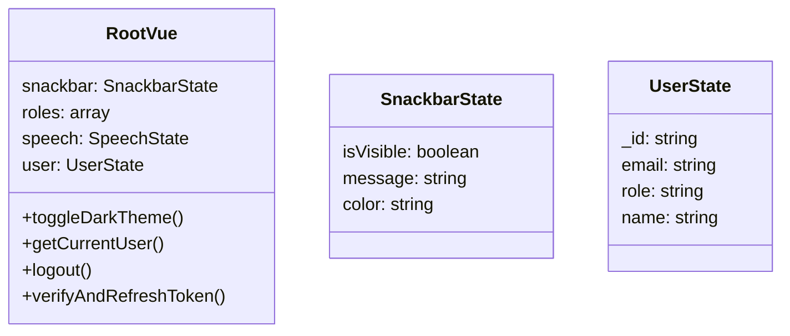
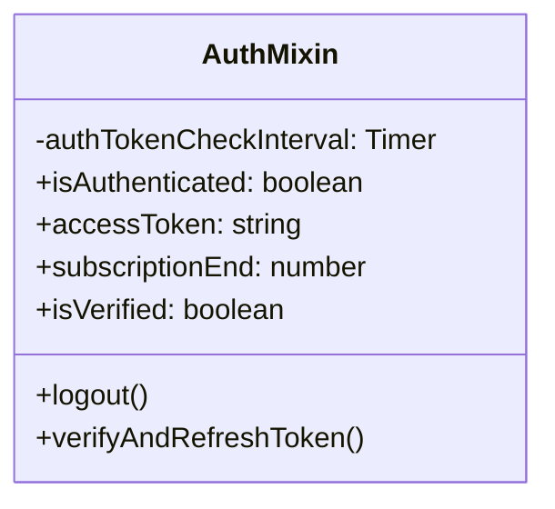

# State Management

## 1. Root Vue Instance State



---

## 2. Snackbar Usage

```javascript
// Show success message
this.$root.$data.snackbar.message = 'Operation successful!'
this.$root.$data.snackbar.isVisible = true
this.$root.$data.snackbar.color = 'success'

// Show error message
this.$root.$data.snackbar.message = 'Something went wrong'
this.$root.$data.snackbar.isVisible = true
this.$root.$data.snackbar.color = 'error'
```

---

## 3. User State

```javascript
// main.js - getCurrentUser()
async getCurrentUser() {
  const jwt = localStorage.getItem('jwt')
  if (!jwt) throw new Error('No JWT found')
  
  const { sub, email, name, role } = jwtDecode(jwt)
  
  this.user = {
    _id: sub,
    email,
    role,
    name
  }
  return this.user
}
```

---

## 4. Auth Mixin



### Lifecycle

- `mounted`: Auto-start token verification if authenticated
- `beforeDestroy`: Stop token verification interval

---

## 5. Theme Persistence

```javascript
// Read theme on app start
created() {
  const theme = localStorage.getItem('theme')
  if (theme === 'dark') {
    this.$vuetify.theme.dark = true
  }
}

// Toggle theme
toggleDarkTheme() {
  this.$vuetify.theme.dark = !this.$vuetify.theme.dark
  localStorage.setItem('theme', this.$vuetify.theme.dark ? 'dark' : 'light')
}
```

---

## 6. Related Files

| File | Description |
|------|-------------|
| [main.js](file:///home/linh/Workspaces/gateway-dashboard/src/main.js) | Root Vue instance |
| [auth.mixin.js](file:///home/linh/Workspaces/gateway-dashboard/src/mixins/auth.mixin.js) | Auth mixin |

*[← Back to Index](./README.md)*
