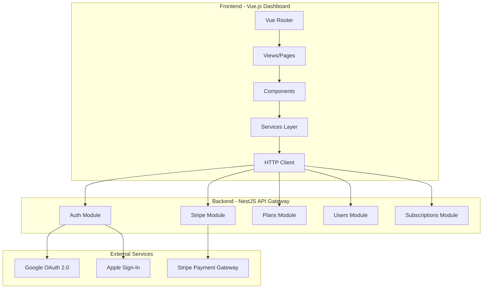

# Gateway Dashboard - System Design Documentation

## Tổng Quan

Gateway Dashboard là một ứng dụng **Vue.js 2 + Vuetify** cung cấp giao diện quản lý cho hệ thống Speech Gateway API. PR #1 bổ sung các tính năng quan trọng:

- 🔐 **Authentication**: Email/Password + Google OAuth + Apple Sign-In
- 💳 **Payment**: Stripe integration cho subscription management
- 📋 **Plans Management**: Admin JSON Editor với diff comparison

---

## High-Level Architecture



---

## Documentation Index

| Document | Mô Tả |
|----------|-------|
| [01-authentication.md](./01-authentication.md) | Hệ thống xác thực: Email/Password, OAuth, Token Management |
| [02-subscription-payment.md](./02-subscription-payment.md) | Stripe integration, Checkout flow, Cancel/Resume |
| [03-plans-management.md](./03-plans-management.md) | Admin Plans Editor, Validation, Diff Comparison |
| [04-routing-navigation.md](./04-routing-navigation.md) | Route configuration, Navigation guards |
| [05-http-client.md](./05-http-client.md) | Axios interceptors, Error handling |
| [06-components.md](./06-components.md) | Component architecture, Data flow |
| [07-state-management.md](./07-state-management.md) | Root Vue state, Auth mixin |
| [08-api-reference.md](./08-api-reference.md) | API endpoints, Request/Response formats |

---

## Tech Stack

| Layer | Technology |
|-------|-----------|
| Framework | Vue.js 2.x |
| UI Library | Vuetify 2.x |
| HTTP Client | Axios |
| Router | Vue Router |
| State | Vue Instance Data + Mixins |
| Payment | Stripe Checkout |
| OAuth | Google, Apple Sign-In |

---

## File Structure

```
gateway-dashboard/
├── src/
│   ├── components/
│   │   └── PlanCard.vue           # Subscription plan card
│   ├── layouts/
│   │   └── Main.vue               # Main app layout
│   ├── mixins/
│   │   └── auth.mixin.js          # Auth mixin for components
│   ├── router/
│   │   ├── index.js               # Route definitions
│   │   └── hooks.js               # Navigation guards
│   ├── services/
│   │   ├── auth.service.js        # Authentication API
│   │   ├── plans.service.js       # Plans API
│   │   ├── stripe.service.js      # Stripe integration
│   │   └── user.service.js        # User/subscription API
│   ├── views/
│   │   ├── SignIn.vue             # Login page
│   │   ├── SignUp.vue             # Registration page
│   │   ├── CompleteSignup.vue     # OAuth completion
│   │   ├── Subscription.vue       # Subscription management
│   │   ├── Success.vue            # Payment success
│   │   ├── Cancel.vue             # Payment cancelled
│   │   └── admin/
│   │       └── JsonPlansEditor.vue# Admin plans editor
│   ├── http.js                    # Axios HTTP client
│   └── main.js                    # App entry point
├── .env.development               # Dev environment
├── .env.production                # Prod environment
└── vue.config.js                  # Webpack config
```

---

## Quick Links

- **Codebase**: [gateway-dashboard](file:///home/linh/Workspaces/gateway-dashboard)
- **Backend**: [api-gateway](file:///home/linh/Workspaces/api-gateway)

---

*Last updated: 2025-01-18*
