# Gateway Dashboard - System Design Documentation

## Tổng Quan Dự Án

Gateway Dashboard là một ứng dụng Vue.js 2 với Vuetify framework, cung cấp giao diện quản lý cho hệ thống Speech Gateway API. PR #1 bổ sung các tính năng quan trọng: **Authentication (Email/Password + OAuth)**, **Subscription Management với Stripe**, và **Admin Plans Management**.

---

## 1. High-Level Architecture

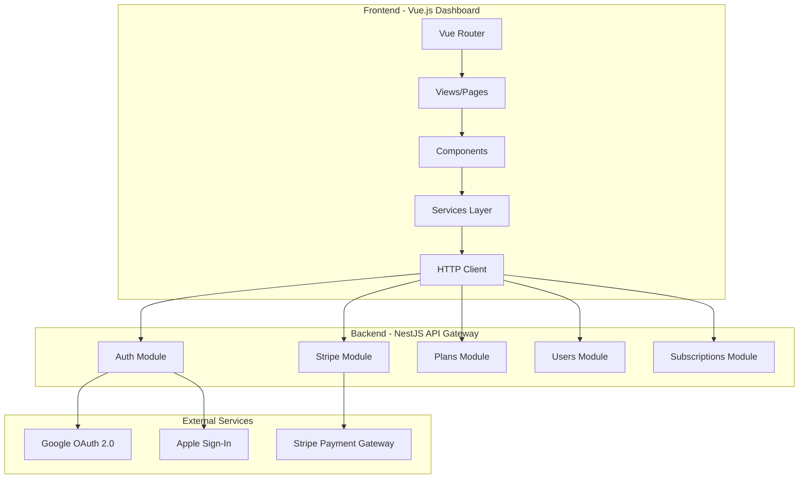
```mermaid
graph TB
    subgraph "Frontend - Vue.js Dashboard"
        A[Vue Router] --> B[Views/Pages]
        B --> C[Components]
        C --> D[Services Layer]
        D --> E[HTTP Client]
    end
    
    subgraph "Backend - NestJS API Gateway"
        F[Auth Module]
        G[Stripe Module]
        H[Plans Module]
        I[Users Module]
        J[Subscriptions Module]
    end
    
    subgraph "External Services"
        K[Google OAuth 2.0]
        L[Apple Sign-In]
        M[Stripe Payment Gateway]
    end
    
    E --> F
    E --> G
    E --> H
    E --> I
    E --> J
    
    F --> K
    F --> L
    G --> M
```

---

## 2. Authentication System

### 2.1 Authentication Flow Overview

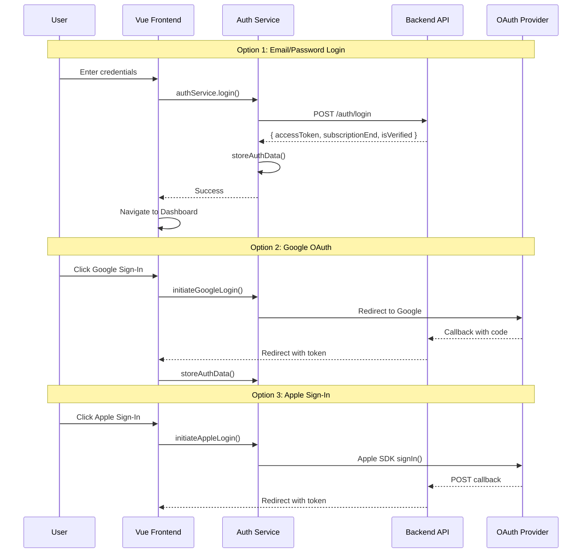
```mermaid
sequenceDiagram
    participant U as User
    participant FE as Vue Frontend
    participant AS as Auth Service
    participant BE as Backend API
    participant OAuth as OAuth Provider
    
    Note over U, OAuth: Option 1: Email/Password Login
    U->>FE: Enter credentials
    FE->>AS: authService.login()
    AS->>BE: POST /auth/login
    BE-->>AS: { accessToken, subscriptionEnd, isVerified }
    AS->>AS: storeAuthData()
    AS-->>FE: Success
    FE->>FE: Navigate to Dashboard
    
    Note over U, OAuth: Option 2: Google OAuth
    U->>FE: Click Google Sign-In
    FE->>AS: initiateGoogleLogin()
    AS->>OAuth: Redirect to Google
    OAuth-->>BE: Callback with code
    BE-->>FE: Redirect with token
    FE->>AS: storeAuthData()
    
    Note over U, OAuth: Option 3: Apple Sign-In
    U->>FE: Click Apple Sign-In
    FE->>AS: initiateAppleLogin()
    AS->>OAuth: Apple SDK signIn()
    OAuth-->>BE: POST callback
    BE-->>FE: Redirect with token
```

### 2.2 Auth Service Architecture

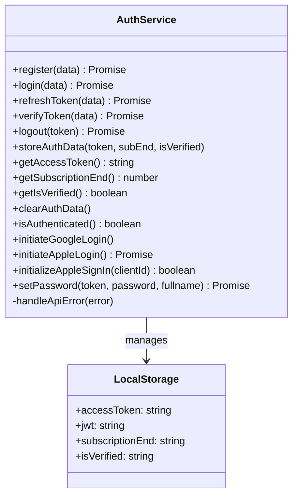
```mermaid
classDiagram
    class AuthService {
        +register(data) Promise
        +login(data) Promise
        +refreshToken(data) Promise
        +verifyToken(data) Promise
        +logout(token) Promise
        +storeAuthData(token, subEnd, isVerified)
        +getAccessToken() string
        +getSubscriptionEnd() number
        +getIsVerified() boolean
        +clearAuthData()
        +isAuthenticated() boolean
        +initiateGoogleLogin()
        +initiateAppleLogin() Promise
        +initializeAppleSignIn(clientId) boolean
        +setPassword(token, password, fullname) Promise
        -handleApiError(error)
    }
    
    class LocalStorage {
        +accessToken: string
        +jwt: string
        +subscriptionEnd: string
        +isVerified: string
    }
    
    AuthService --> LocalStorage : manages
```

### 2.3 Token Management Flow

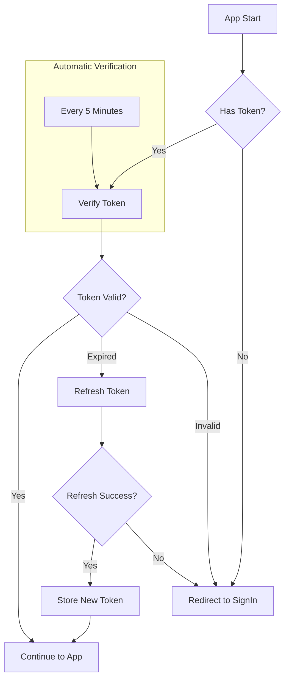
```mermaid
flowchart TD
    A[App Start] --> B{Has Token?}
    B -->|Yes| C[Verify Token]
    B -->|No| D[Redirect to SignIn]
    
    C --> E{Token Valid?}
    E -->|Yes| F[Continue to App]
    E -->|Expired| G[Refresh Token]
    E -->|Invalid| D
    
    G --> H{Refresh Success?}
    H -->|Yes| I[Store New Token]
    H -->|No| D
    
    I --> F
    
    subgraph "Automatic Verification"
        J[Every 5 Minutes] --> C
    end
```

### 2.4 OAuth Complete Signup Flow

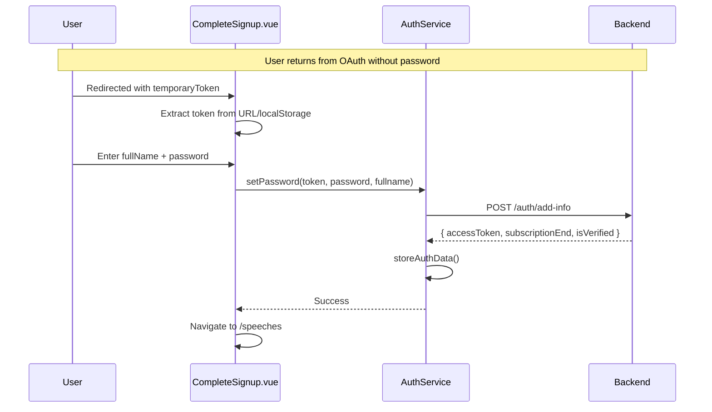
```mermaid
sequenceDiagram
    participant U as User
    participant FE as CompleteSignup.vue
    participant AS as AuthService
    participant BE as Backend
    
    Note over U, BE: User returns from OAuth without password
    U->>FE: Redirected with temporaryToken
    FE->>FE: Extract token from URL/localStorage
    U->>FE: Enter fullName + password
    FE->>AS: setPassword(token, password, fullname)
    AS->>BE: POST /auth/add-info
    BE-->>AS: { accessToken, subscriptionEnd, isVerified }
    AS->>AS: storeAuthData()
    AS-->>FE: Success
    FE->>FE: Navigate to /speeches
```

---

## 3. Subscription & Payment System

### 3.1 Stripe Integration Architecture

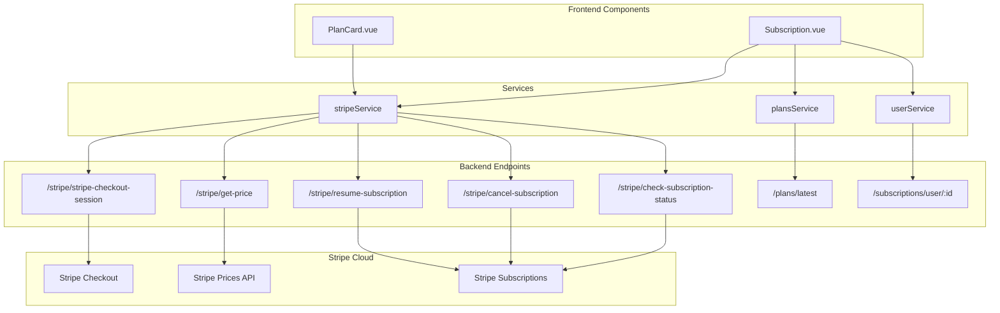
```mermaid
graph TB
    subgraph "Frontend Components"
        A[Subscription.vue]
        B[PlanCard.vue]
    end
    
    subgraph "Services"
        C[stripeService]
        D[plansService]
        E[userService]
    end
    
    subgraph "Backend Endpoints"
        F["/stripe/stripe-checkout-session"]
        G["/stripe/check-subscription-status"]
        H["/stripe/cancel-subscription"]
        I["/stripe/resume-subscription"]
        J["/stripe/get-price"]
        K["/plans/latest"]
        L["/subscriptions/user/:id"]
    end
    
    subgraph "Stripe Cloud"
        M[Stripe Checkout]
        N[Stripe Prices API]
        O[Stripe Subscriptions]
    end
    
    A --> C
    A --> D
    A --> E
    B --> C
    
    C --> F
    C --> G
    C --> H
    C --> I
    C --> J
    D --> K
    E --> L
    
    F --> M
    J --> N
    G --> O
    H --> O
    I --> O
```

### 3.2 Subscription Purchase Flow

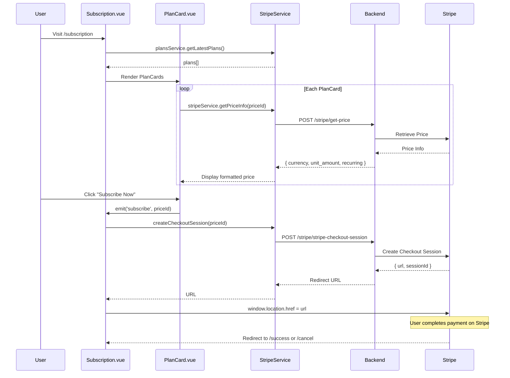
```mermaid
sequenceDiagram
    participant U as User
    participant SUB as Subscription.vue
    participant PC as PlanCard.vue
    participant SS as StripeService
    participant BE as Backend
    participant ST as Stripe
    
    U->>SUB: Visit /subscription
    SUB->>SS: plansService.getLatestPlans()
    SS-->>SUB: plans[]
    SUB->>PC: Render PlanCards
    
    loop Each PlanCard
        PC->>SS: stripeService.getPriceInfo(priceId)
        SS->>BE: POST /stripe/get-price
        BE->>ST: Retrieve Price
        ST-->>BE: Price Info
        BE-->>SS: { currency, unit_amount, recurring }
        SS-->>PC: Display formatted price
    end
    
    U->>PC: Click "Subscribe Now"
    PC->>SUB: emit('subscribe', priceId)
    SUB->>SS: createCheckoutSession(priceId)
    SS->>BE: POST /stripe/stripe-checkout-session
    BE->>ST: Create Checkout Session
    ST-->>BE: { url, sessionId }
    BE-->>SS: Redirect URL
    SS-->>SUB: URL
    SUB->>ST: window.location.href = url
    
    Note over ST: User completes payment on Stripe
    ST-->>SUB: Redirect to /success or /cancel
```

### 3.3 Stripe Service Methods

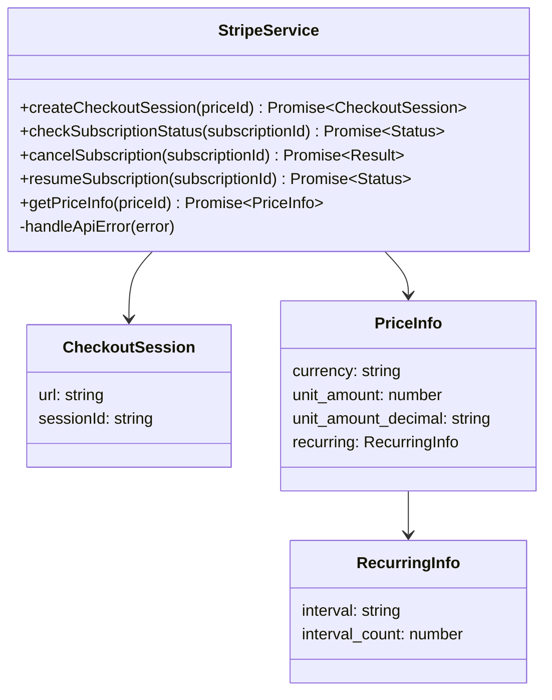
```mermaid
classDiagram
    class StripeService {
        +createCheckoutSession(priceId) Promise~CheckoutSession~
        +checkSubscriptionStatus(subscriptionId) Promise~Status~
        +cancelSubscription(subscriptionId) Promise~Result~
        +resumeSubscription(subscriptionId) Promise~Status~
        +getPriceInfo(priceId) Promise~PriceInfo~
        -handleApiError(error)
    }
    
    class CheckoutSession {
        url: string
        sessionId: string
    }
    
    class PriceInfo {
        currency: string
        unit_amount: number
        unit_amount_decimal: string
        recurring: RecurringInfo
    }
    
    class RecurringInfo {
        interval: string
        interval_count: number
    }
    
    StripeService --> CheckoutSession
    StripeService --> PriceInfo
    PriceInfo --> RecurringInfo
```

### 3.4 Subscription Status Management

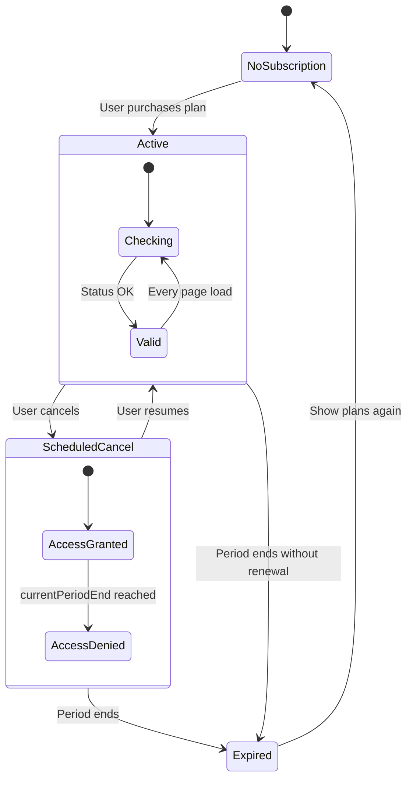
```mermaid
stateDiagram-v2
    [*] --> NoSubscription
    
    NoSubscription --> Active: User purchases plan
    Active --> ScheduledCancel: User cancels
    ScheduledCancel --> Active: User resumes
    ScheduledCancel --> Expired: Period ends
    Active --> Expired: Period ends without renewal
    
    state Active {
        [*] --> Checking
        Checking --> Valid: Status OK
        Valid --> Checking: Every page load
    }
    
    state ScheduledCancel {
        [*] --> AccessGranted
        AccessGranted --> AccessDenied: currentPeriodEnd reached
    }
    
    Expired --> NoSubscription: Show plans again
```

### 3.5 Cancel & Resume Flow

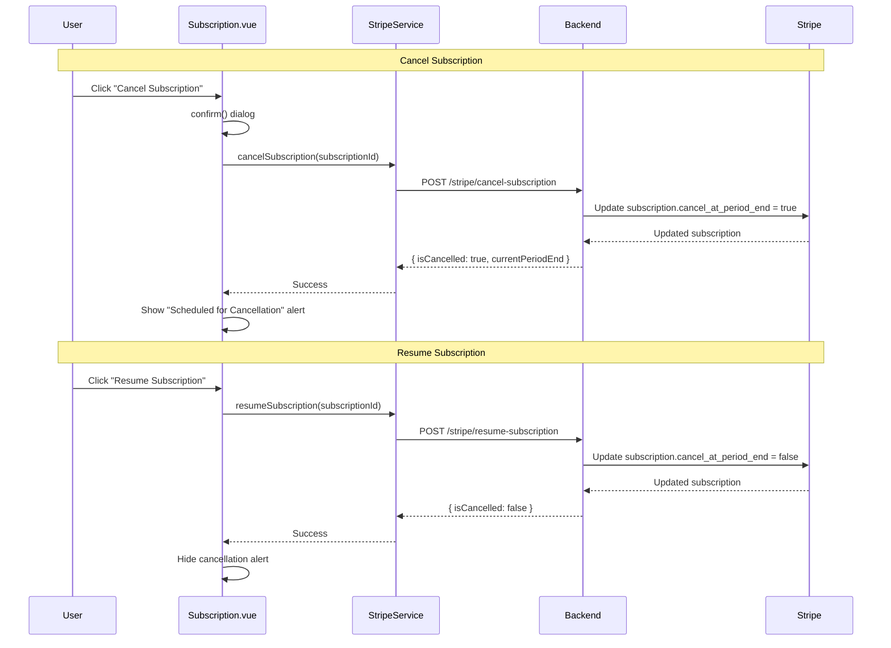
```mermaid
sequenceDiagram
    participant U as User
    participant SUB as Subscription.vue
    participant SS as StripeService
    participant BE as Backend
    participant ST as Stripe
    
    Note over U, ST: Cancel Subscription
    U->>SUB: Click "Cancel Subscription"
    SUB->>SUB: confirm() dialog
    SUB->>SS: cancelSubscription(subscriptionId)
    SS->>BE: POST /stripe/cancel-subscription
    BE->>ST: Update subscription.cancel_at_period_end = true
    ST-->>BE: Updated subscription
    BE-->>SS: { isCancelled: true, currentPeriodEnd }
    SS-->>SUB: Success
    SUB->>SUB: Show "Scheduled for Cancellation" alert
    
    Note over U, ST: Resume Subscription
    U->>SUB: Click "Resume Subscription"
    SUB->>SS: resumeSubscription(subscriptionId)
    SS->>BE: POST /stripe/resume-subscription
    BE->>ST: Update subscription.cancel_at_period_end = false
    ST-->>BE: Updated subscription
    BE-->>SS: { isCancelled: false }
    SS-->>SUB: Success
    SUB->>SUB: Hide cancellation alert
```

---

## 4. Plans Management System

### 4.1 Plans Data Model

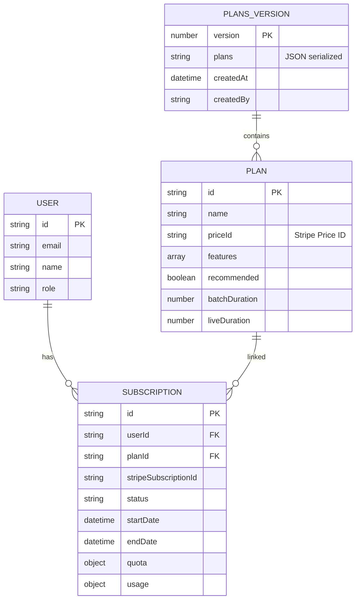
```mermaid
erDiagram
    PLAN {
        string id PK
        string name
        string priceId "Stripe Price ID"
        array features
        boolean recommended
        number batchDuration
        number liveDuration
    }
    
    PLANS_VERSION {
        number version PK
        string plans "JSON serialized"
        datetime createdAt
        string createdBy
    }
    
    SUBSCRIPTION {
        string id PK
        string userId FK
        string planId FK
        string stripeSubscriptionId
        string status
        datetime startDate
        datetime endDate
        object quota
        object usage
    }
    
    USER {
        string id PK
        string email
        string name
        string role
    }
    
    PLANS_VERSION ||--o{ PLAN : contains
    USER ||--o{ SUBSCRIPTION : has
    PLAN ||--o{ SUBSCRIPTION : linked
```

### 4.2 Admin Plans Editor Flow

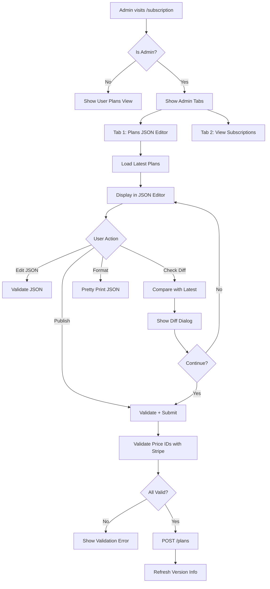
```mermaid
flowchart TD
    A[Admin visits /subscription] --> B{Is Admin?}
    B -->|No| C[Show User Plans View]
    B -->|Yes| D[Show Admin Tabs]
    
    D --> E[Tab 1: Plans JSON Editor]
    D --> F[Tab 2: View Subscriptions]
    
    E --> G[Load Latest Plans]
    G --> H[Display in JSON Editor]
    
    H --> I{User Action}
    I -->|Edit JSON| J[Validate JSON]
    I -->|Check Diff| K[Compare with Latest]
    I -->|Format| L[Pretty Print JSON]
    I -->|Publish| M[Validate + Submit]
    
    K --> N[Show Diff Dialog]
    N --> O{Continue?}
    O -->|Yes| M
    O -->|No| H
    
    M --> P[Validate Price IDs with Stripe]
    P --> Q{All Valid?}
    Q -->|No| R[Show Validation Error]
    Q -->|Yes| S[POST /plans]
    S --> T[Refresh Version Info]
```

### 4.3 Plans Validation Flow

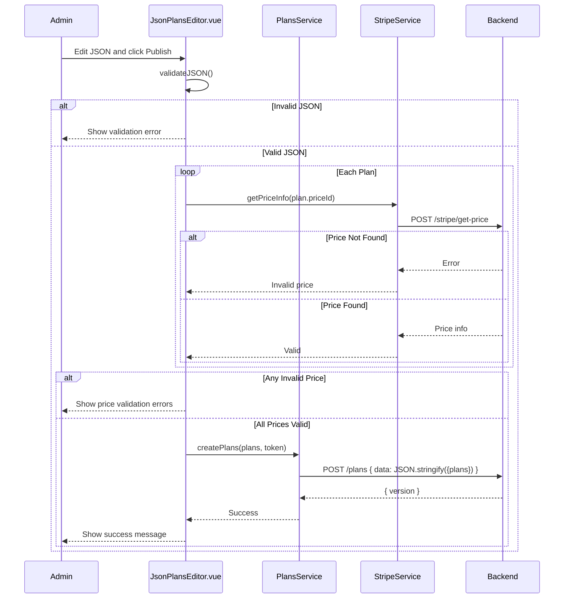
```mermaid
sequenceDiagram
    participant ADMIN as Admin
    participant JPE as JsonPlansEditor.vue
    participant PS as PlansService
    participant SS as StripeService
    participant BE as Backend
    
    ADMIN->>JPE: Edit JSON and click Publish
    JPE->>JPE: validateJSON()
    
    alt Invalid JSON
        JPE-->>ADMIN: Show validation error
    else Valid JSON
        loop Each Plan
            JPE->>SS: getPriceInfo(plan.priceId)
            SS->>BE: POST /stripe/get-price
            alt Price Not Found
                BE-->>SS: Error
                SS-->>JPE: Invalid price
            else Price Found
                BE-->>SS: Price info
                SS-->>JPE: Valid
            end
        end
        
        alt Any Invalid Price
            JPE-->>ADMIN: Show price validation errors
        else All Prices Valid
            JPE->>PS: createPlans(plans, token)
            PS->>BE: POST /plans { data: JSON.stringify({plans}) }
            BE-->>PS: { version }
            PS-->>JPE: Success
            JPE-->>ADMIN: Show success message
        end
    end
```

---

## 5. Routing & Navigation

### 5.1 Route Configuration

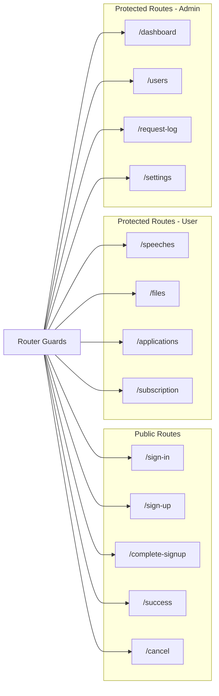
```mermaid
graph LR
    subgraph "Public Routes"
        A["/sign-in"]
        B["/sign-up"]
        C["/complete-signup"]
        D["/success"]
        E["/cancel"]
    end
    
    subgraph "Protected Routes - User"
        F["/speeches"]
        G["/files"]
        H["/applications"]
        I["/subscription"]
    end
    
    subgraph "Protected Routes - Admin"
        J["/dashboard"]
        K["/users"]
        L["/request-log"]
        M["/settings"]
    end
    
    N[Router Guards] --> A
    N --> B
    N --> C
    N --> D
    N --> E
    N --> F
    N --> G
    N --> H
    N --> I
    N --> J
    N --> K
    N --> L
    N --> M
```

### 5.2 Router Guards Flow

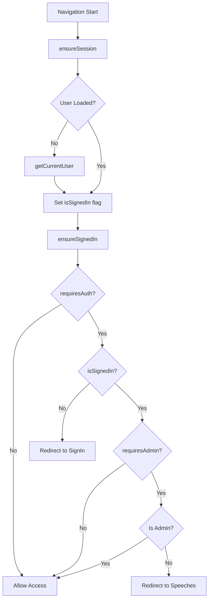
```mermaid
flowchart TD
    A[Navigation Start] --> B[ensureSession]
    B --> C{User Loaded?}
    C -->|No| D[getCurrentUser]
    C -->|Yes| E[Set isSignedIn flag]
    D --> E
    
    E --> F[ensureSignedIn]
    F --> G{requiresAuth?}
    G -->|No| H[Allow Access]
    G -->|Yes| I{isSignedIn?}
    
    I -->|No| J[Redirect to SignIn]
    I -->|Yes| K{requiresAdmin?}
    
    K -->|No| H
    K -->|Yes| L{Is Admin?}
    
    L -->|Yes| H
    L -->|No| M[Redirect to Speeches]
```

---

## 6. HTTP Client & Error Handling

### 6.1 HTTP Interceptors Architecture

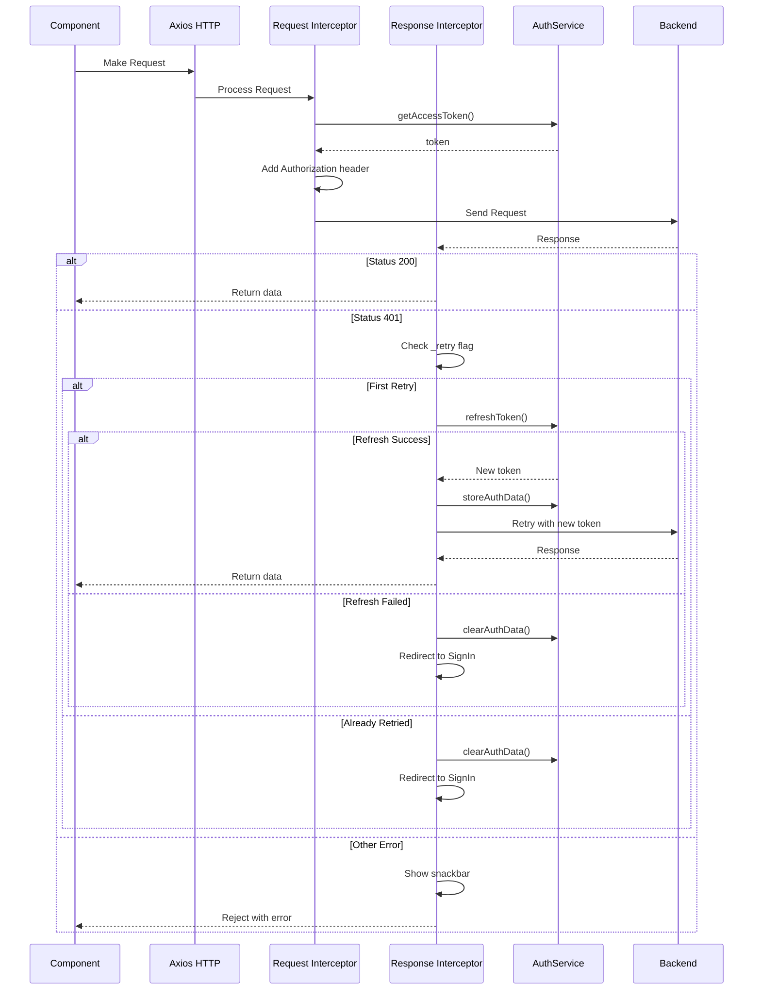
```mermaid
sequenceDiagram
    participant C as Component
    participant HTTP as Axios HTTP
    participant REQ as Request Interceptor
    participant RES as Response Interceptor
    participant AS as AuthService
    participant BE as Backend
    
    C->>HTTP: Make Request
    HTTP->>REQ: Process Request
    REQ->>AS: getAccessToken()
    AS-->>REQ: token
    REQ->>REQ: Add Authorization header
    
    REQ->>BE: Send Request
    BE-->>RES: Response
    
    alt Status 200
        RES-->>C: Return data
    else Status 401
        RES->>RES: Check _retry flag
        alt First Retry
            RES->>AS: refreshToken()
            alt Refresh Success
                AS-->>RES: New token
                RES->>AS: storeAuthData()
                RES->>BE: Retry with new token
                BE-->>RES: Response
                RES-->>C: Return data
            else Refresh Failed
                RES->>AS: clearAuthData()
                RES->>RES: Redirect to SignIn
            end
        else Already Retried
            RES->>AS: clearAuthData()
            RES->>RES: Redirect to SignIn
        end
    else Other Error
        RES->>RES: Show snackbar
        RES-->>C: Reject with error
    end
```

---

## 7. Component Architecture

### 7.1 Main Layout Components

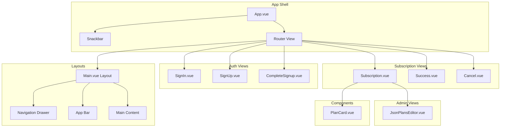
```mermaid
graph TB
    subgraph "App Shell"
        A[App.vue] --> B[Snackbar]
        A --> C[Router View]
    end
    
    subgraph "Layouts"
        D[Main.vue Layout]
        D --> E[Navigation Drawer]
        D --> F[App Bar]
        D --> G[Main Content]
    end
    
    subgraph "Auth Views"
        H[SignIn.vue]
        I[SignUp.vue]
        J[CompleteSignup.vue]
    end
    
    subgraph "Subscription Views"
        K[Subscription.vue]
        L[Success.vue]
        M[Cancel.vue]
    end
    
    subgraph "Admin Views"
        N[JsonPlansEditor.vue]
    end
    
    subgraph "Components"
        O[PlanCard.vue]
    end
    
    C --> D
    C --> H
    C --> I
    C --> J
    C --> K
    C --> L
    C --> M
    
    K --> N
    K --> O
```

### 7.2 PlanCard Component Data Flow

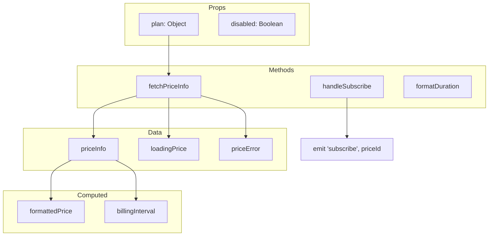
```mermaid
flowchart TD
    subgraph "Props"
        A[plan: Object]
        B[disabled: Boolean]
    end
    
    subgraph "Data"
        C[priceInfo]
        D[loadingPrice]
        E[priceError]
    end
    
    subgraph "Computed"
        F[formattedPrice]
        G[billingInterval]
    end
    
    subgraph "Methods"
        H[fetchPriceInfo]
        I[handleSubscribe]
        J[formatDuration]
    end
    
    A --> H
    H --> C
    H --> D
    H --> E
    C --> F
    C --> G
    
    I --> K[emit 'subscribe', priceId]
```

---

## 8. State Management

### 8.1 Root Vue Instance State

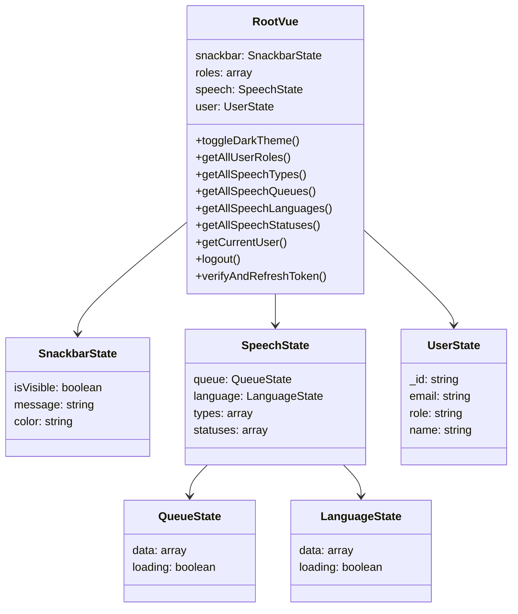
```mermaid
classDiagram
    class RootVue {
        snackbar: SnackbarState
        roles: array
        speech: SpeechState
        user: UserState
        +toggleDarkTheme()
        +getAllUserRoles()
        +getAllSpeechTypes()
        +getAllSpeechQueues()
        +getAllSpeechLanguages()
        +getAllSpeechStatuses()
        +getCurrentUser()
        +logout()
        +verifyAndRefreshToken()
    }
    
    class SnackbarState {
        isVisible: boolean
        message: string
        color: string
    }
    
    class SpeechState {
        queue: QueueState
        language: LanguageState
        types: array
        statuses: array
    }
    
    class QueueState {
        data: array
        loading: boolean
    }
    
    class LanguageState {
        data: array
        loading: boolean
    }
    
    class UserState {
        _id: string
        email: string
        role: string
        name: string
    }
    
    RootVue --> SnackbarState
    RootVue --> SpeechState
    RootVue --> UserState
    SpeechState --> QueueState
    SpeechState --> LanguageState
```

### 8.2 Auth Mixin State

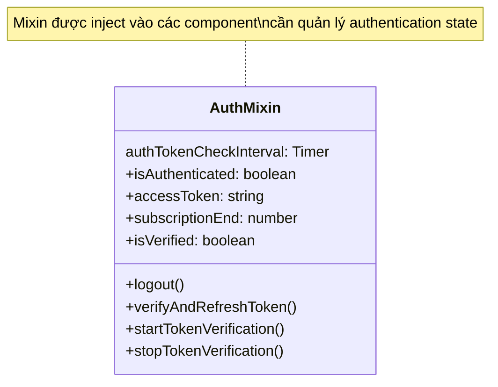
```mermaid
classDiagram
    class AuthMixin {
        authTokenCheckInterval: Timer
        +isAuthenticated: boolean
        +accessToken: string
        +subscriptionEnd: number
        +isVerified: boolean
        +logout()
        +verifyAndRefreshToken()
        +startTokenVerification()
        +stopTokenVerification()
    }
    
    note for AuthMixin "Mixin được inject vào các component\ncần quản lý authentication state"
```

---

## 9. Environment Configuration

### 9.1 Environment Variables

```mermaid
graph LR
    subgraph "Development"
        A[".env.development"]
        A --> B["DNS_URL=https://linh-fyp.koreacentral.cloudapp.azure.com"]
        A --> C["BACKEND_URL=http://localhost:8081"]
        A --> D["VUE_APP_GATEWAY_URL=${DNS_URL}/api"]
        A --> E["VUE_APP_APPLE_CLIENT_ID=sg.speechlab.gateway"]
    end
    
    subgraph "Production"
        F[".env.production"]
        F --> G["DNS_URL=https://gatewayapi.speechlab.sg"]
        F --> H["VUE_APP_GATEWAY_URL=https://gatewayapi.speechlab.sg/api"]
        F --> I["VUE_APP_APPLE_CLIENT_ID=sg.speechlab.gateway"]
    end
```

---

## 10. Security Considerations

### 10.1 Token Security

```mermaid
flowchart TD
    subgraph "Token Storage"
        A[localStorage.accessToken]
        B[localStorage.jwt]
        C[localStorage.subscriptionEnd]
        D[localStorage.isVerified]
    end
    
    subgraph "Security Measures"
        E[HTTPS Only]
        F[Token Verification Every 5min]
        G[Auto Refresh on 401]
        H[Clear on Logout]
        I[Backend Revocation Support]
    end
    
    A --> E
    A --> F
    A --> G
    A --> H
    A --> I
```

### 10.2 Route Protection

```mermaid
flowchart TD
    A[Route Request] --> B{Public Route?}
    B -->|Yes| C[Allow]
    B -->|No| D{Has Valid Token?}
    
    D -->|No| E[Redirect to SignIn]
    D -->|Yes| F{Admin Route?}
    
    F -->|No| C
    F -->|Yes| G{User is Admin?}
    
    G -->|Yes| C
    G -->|No| H[Redirect to Speeches]
```

---

## 11. API Endpoints Summary

| Service | Endpoint | Method | Auth | Description |
|---------|----------|--------|------|-------------|
| Auth | `/auth/register` | POST | No | Register new user |
| Auth | `/auth/login` | POST | No | Login with email/password |
| Auth | `/auth/refresh-token` | POST | No | Refresh expired token |
| Auth | `/auth/verify-token` | POST | No | Verify token validity |
| Auth | `/auth/logout` | POST | Yes | Logout and revoke token |
| Auth | `/auth/google/login` | GET | No | Initiate Google OAuth |
| Auth | `/auth/apple/callback` | POST | No | Apple OAuth callback |
| Auth | `/auth/add-info` | POST | No | Complete OAuth signup |
| Stripe | `/stripe/stripe-checkout-session` | POST | Yes | Create checkout session |
| Stripe | `/stripe/check-subscription-status` | POST | Yes | Check subscription status |
| Stripe | `/stripe/cancel-subscription` | POST | Yes | Cancel subscription |
| Stripe | `/stripe/resume-subscription` | POST | Yes | Resume cancelled subscription |
| Stripe | `/stripe/get-price` | POST | No | Get Stripe price info |
| Plans | `/plans/latest` | GET | No | Get latest published plans |
| Plans | `/plans` | POST | Admin | Create/publish new plans |
| Users | `/users/current` | GET | Yes | Get current user info |
| Subscriptions | `/subscriptions/user/:id` | GET | Yes | Get user subscription |

---

## 12. File Structure

```
gateway-dashboard/
├── src/
│   ├── components/
│   │   └── PlanCard.vue           # Subscription plan card
│   ├── layouts/
│   │   └── Main.vue               # Main app layout
│   ├── mixins/
│   │   └── auth.mixin.js          # Auth mixin for components
│   ├── router/
│   │   ├── index.js               # Route definitions
│   │   └── hooks.js               # Navigation guards
│   ├── services/
│   │   ├── auth.service.js        # Authentication API
│   │   ├── plans.service.js       # Plans API
│   │   ├── stripe.service.js      # Stripe integration
│   │   └── user.service.js        # User/subscription API
│   ├── views/
│   │   ├── SignIn.vue             # Login page
│   │   ├── SignUp.vue             # Registration page
│   │   ├── CompleteSignup.vue     # OAuth completion
│   │   ├── Subscription.vue       # Subscription management
│   │   ├── Success.vue            # Payment success
│   │   ├── Cancel.vue             # Payment cancelled
│   │   └── admin/
│   │       └── JsonPlansEditor.vue# Admin plans editor
│   ├── http.js                    # Axios HTTP client
│   └── main.js                    # App entry point
├── .env.development               # Dev environment
├── .env.production                # Prod environment
└── vue.config.js                  # Webpack config
```

---

## 13. Key Design Patterns Used

### 13.1 Service Layer Pattern
Tất cả API calls được đóng gói trong các service riêng biệt (`authService`, `stripeService`, `plansService`, `userService`), tách biệt logic business khỏi components.

### 13.2 Mixin Pattern
`authMixin` cung cấp shared authentication functionality cho nhiều components mà không cần duplicate code.

### 13.3 Interceptor Pattern
HTTP interceptors xử lý token injection và automatic retry logic một cách transparent với application code.

### 13.4 Guard Pattern
Router guards (`ensureSession`, `ensureSignedIn`) bảo vệ routes dựa trên authentication và authorization state.

### 13.5 Component Composition
Các views như `Subscription.vue` compose từ nhiều smaller components (`PlanCard`, `JsonPlansEditor`).

---

## 14. Feature Summary

| Feature | Files Involved | Services Used |
|---------|----------------|---------------|
| Email/Password Auth | SignIn.vue, SignUp.vue | authService |
| Google OAuth | SignIn.vue, SignUp.vue | authService |
| Apple Sign-In | SignIn.vue, SignUp.vue | authService |
| OAuth Completion | CompleteSignup.vue | authService |
| Token Management | main.js, http.js, auth.mixin.js | authService |
| Plan Display | Subscription.vue, PlanCard.vue | plansService, stripeService |
| Checkout Flow | PlanCard.vue, Subscription.vue | stripeService |
| Cancel/Resume | Subscription.vue | stripeService |
| Admin Plans Editor | JsonPlansEditor.vue | plansService, stripeService |
| Route Protection | router/hooks.js, router/index.js | authService |

---

*Document generated for Gateway Dashboard PR #1*
*Last updated: 2025-01-18*
